# Langfuse - Product Overview

**One-Page Executive Summary**

---

## What is Langfuse?

Langfuse is an open-source **LLM engineering platform** that provides observability, prompt management, and evaluation capabilities for AI applications. It brings production-grade monitoring and quality assurance to large language model deployments, enabling teams to debug, optimize, and maintain LLM applications at scale.

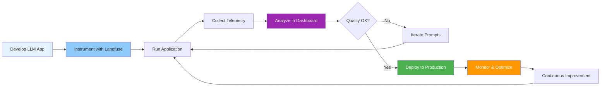
```mermaid
graph LR
    A[Develop LLM App] --> B[Instrument with Langfuse]
    B --> C[Run Application]
    C --> D[Collect Telemetry]
    D --> E[Analyze in Dashboard]
    E --> F{Quality OK?}
    F -->|No| G[Iterate Prompts]
    F -->|Yes| H[Deploy to Production]
    G --> C
    H --> I[Monitor & Optimize]
    I --> J[Continuous Improvement]
    J --> C

    style A fill:#E3F2FD
    style B fill:#90CAF9
    style H fill:#4CAF50,color:#fff
    style I fill:#FF9800,color:#fff
    style E fill:#9C27B0,color:#fff
```

---

## Core Capabilities

### 1. **Observability & Tracing**
Complete visibility into LLM application execution

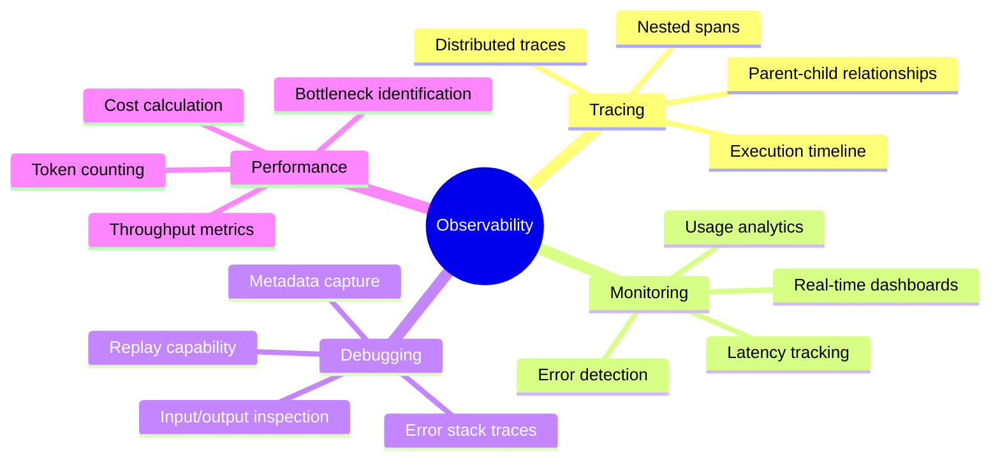
```mermaid
mindmap
  root((Observability))
    Tracing
      Distributed traces
      Nested spans
      Execution timeline
      Parent-child relationships
    Monitoring
      Real-time dashboards
      Latency tracking
      Error detection
      Usage analytics
    Debugging
      Input/output inspection
      Metadata capture
      Error stack traces
      Replay capability
    Performance
      Token counting
      Cost calculation
      Throughput metrics
      Bottleneck identification
```

### 2. **Prompt Management**
Centralized prompt engineering and versioning

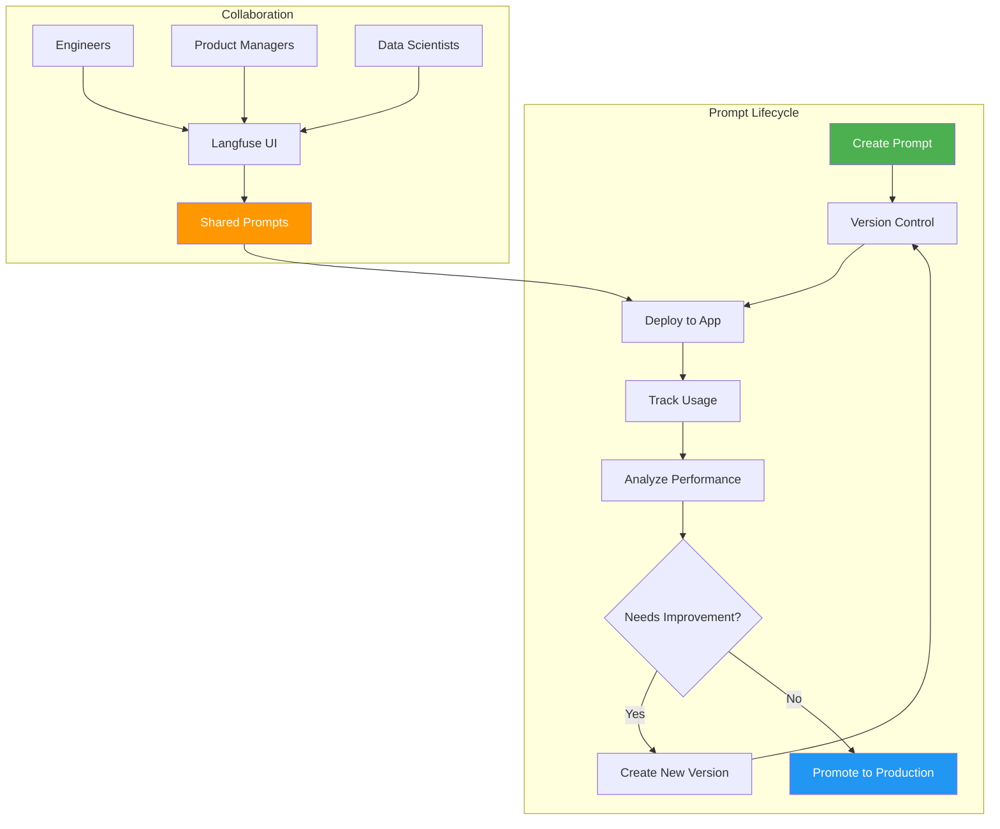
```mermaid
graph TB
    subgraph "Prompt Lifecycle"
        A[Create Prompt] --> B[Version Control]
        B --> C[Deploy to App]
        C --> D[Track Usage]
        D --> E[Analyze Performance]
        E --> F{Needs Improvement?}
        F -->|Yes| G[Create New Version]
        F -->|No| H[Promote to Production]
        G --> B
    end

    subgraph "Collaboration"
        I[Engineers] --> J[Langfuse UI]
        K[Product Managers] --> J
        L[Data Scientists] --> J
        J --> M[Shared Prompts]
    end

    M --> C

    style A fill:#4CAF50,color:#fff
    style H fill:#2196F3,color:#fff
    style M fill:#FF9800,color:#fff
```

### 3. **Evaluation & Testing**
Dataset-based quality assurance and regression testing

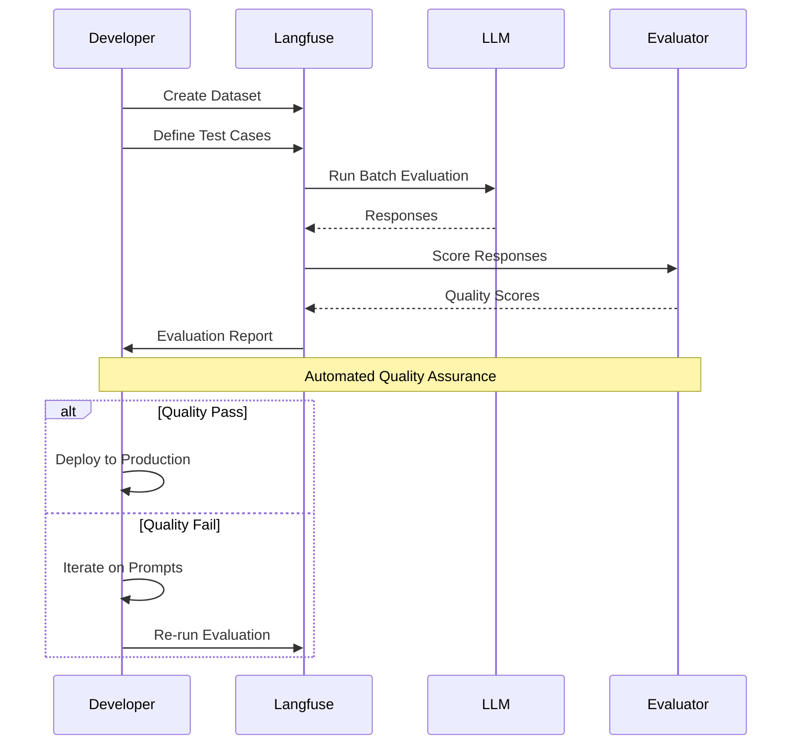
```mermaid
sequenceDiagram
    participant Dev as Developer
    participant LF as Langfuse
    participant Model as LLM
    participant Eval as Evaluator

    Dev->>LF: Create Dataset
    Dev->>LF: Define Test Cases
    LF->>Model: Run Batch Evaluation
    Model-->>LF: Responses
    LF->>Eval: Score Responses
    Eval-->>LF: Quality Scores
    LF->>Dev: Evaluation Report

    Note over Dev,Eval: Automated Quality Assurance

    alt Quality Pass
        Dev->>Dev: Deploy to Production
    else Quality Fail
        Dev->>Dev: Iterate on Prompts
        Dev->>LF: Re-run Evaluation
    end
```

---

## Key Features

| Feature | Description | Business Value |
|---------|-------------|----------------|
| **Distributed Tracing** | Track execution across services with nested spans | Debug complex workflows 10x faster |
| **Automatic Instrumentation** | Drop-in SDK integration with popular frameworks | Zero-code observability |
| **Prompt Versioning** | Git-like version control for prompts | Safe iteration without deployments |
| **Cost Tracking** | Real-time token and API cost monitoring | Reduce costs by 30-50% |
| **Dataset Management** | Reusable test cases and ground truth data | Prevent regressions |
| **Custom Scoring** | Flexible evaluation metrics and judges | Quality assurance automation |
| **User Analytics** | Session tracking and user journey analysis | Understand usage patterns |
| **Multi-Provider** | Works with OpenAI, Anthropic, Google, local models | Avoid vendor lock-in |
| **Self-Hostable** | Deploy on your infrastructure | Complete data control |
| **API Access** | REST and SDK for programmatic access | Integrate with any workflow |
| **Collaboration** | Team workspaces and role-based access | Scale across organization |
| **Alerts & Webhooks** | Proactive notifications for issues | Rapid incident response |

---

## Architecture Overview

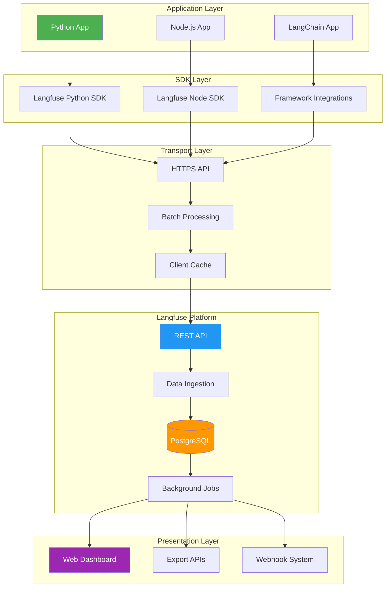
```mermaid
graph TB
    subgraph "Application Layer"
        App1[Python App]
        App2[Node.js App]
        App3[LangChain App]
    end

    subgraph "SDK Layer"
        SDK1[Langfuse Python SDK]
        SDK2[Langfuse Node SDK]
        SDK3[Framework Integrations]
    end

    subgraph "Transport Layer"
        HTTP[HTTPS API]
        Batch[Batch Processing]
        Cache[Client Cache]
    end

    subgraph "Langfuse Platform"
        API[REST API]
        Ingest[Data Ingestion]
        Store[(PostgreSQL)]
        Process[Background Jobs]
    end

    subgraph "Presentation Layer"
        Web[Web Dashboard]
        Export[Export APIs]
        Webhooks[Webhook System]
    end

    App1 --> SDK1
    App2 --> SDK2
    App3 --> SDK3

    SDK1 --> HTTP
    SDK2 --> HTTP
    SDK3 --> HTTP

    HTTP --> Batch
    Batch --> Cache

    Cache --> API
    API --> Ingest
    Ingest --> Store
    Store --> Process

    Process --> Web
    Process --> Export
    Process --> Webhooks

    style App1 fill:#4CAF50,color:#fff
    style API fill:#2196F3,color:#fff
    style Store fill:#FF9800,color:#fff
    style Web fill:#9C27B0,color:#fff
```

---

## Data Model Hierarchy

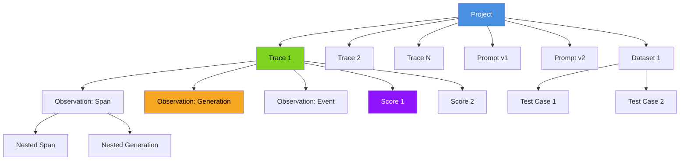
```mermaid
graph TD
    Project[Project] --> Trace1[Trace 1]
    Project --> Trace2[Trace 2]
    Project --> TraceN[Trace N]

    Trace1 --> Obs1[Observation: Span]
    Trace1 --> Obs2[Observation: Generation]
    Trace1 --> Obs3[Observation: Event]

    Obs1 --> NestedObs1[Nested Span]
    Obs1 --> NestedObs2[Nested Generation]

    Trace1 --> Score1[Score 1]
    Trace1 --> Score2[Score 2]

    Project --> Prompt1[Prompt v1]
    Project --> Prompt2[Prompt v2]

    Project --> Dataset1[Dataset 1]
    Dataset1 --> Item1[Test Case 1]
    Dataset1 --> Item2[Test Case 2]

    style Project fill:#4A90E2,color:#fff
    style Trace1 fill:#7ED321,color:#000
    style Obs2 fill:#F5A623,color:#000
    style Score1 fill:#9013FE,color:#fff
```

---

## Use Cases & Workflows

### Customer Support Chatbot

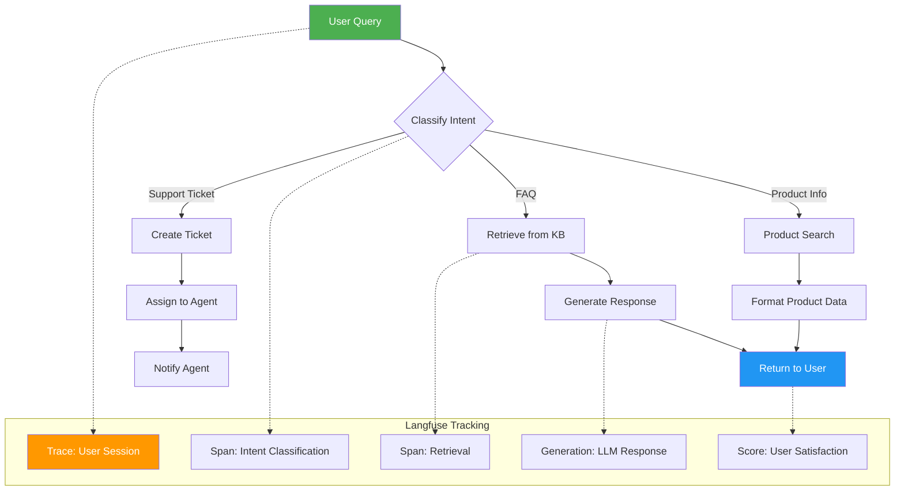
```mermaid
flowchart TD
    A[User Query] --> B{Classify Intent}
    B -->|FAQ| C[Retrieve from KB]
    B -->|Support Ticket| D[Create Ticket]
    B -->|Product Info| E[Product Search]

    C --> F[Generate Response]
    D --> G[Assign to Agent]
    E --> H[Format Product Data]

    F --> I[Return to User]
    H --> I
    G --> J[Notify Agent]

    subgraph "Langfuse Tracking"
        K[Trace: User Session]
        L[Span: Intent Classification]
        M[Span: Retrieval]
        N[Generation: LLM Response]
        O[Score: User Satisfaction]
    end

    A -.-> K
    B -.-> L
    C -.-> M
    F -.-> N
    I -.-> O

    style A fill:#4CAF50,color:#fff
    style I fill:#2196F3,color:#fff
    style K fill:#FF9800,color:#fff
```

### RAG Application Monitoring

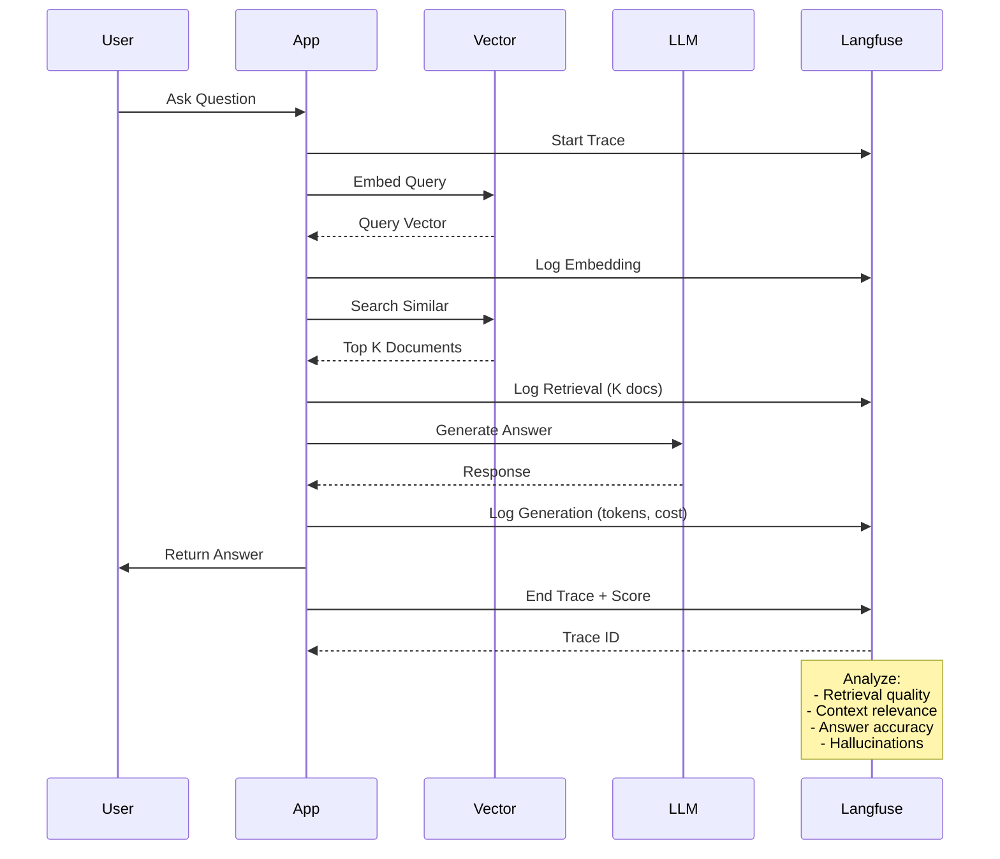
```mermaid
sequenceDiagram
    participant User
    participant App
    participant Vector
    participant LLM
    participant LF as Langfuse

    User->>App: Ask Question
    App->>LF: Start Trace

    App->>Vector: Embed Query
    Vector-->>App: Query Vector
    App->>LF: Log Embedding

    App->>Vector: Search Similar
    Vector-->>App: Top K Documents
    App->>LF: Log Retrieval (K docs)

    App->>LLM: Generate Answer
    LLM-->>App: Response
    App->>LF: Log Generation (tokens, cost)

    App->>User: Return Answer
    App->>LF: End Trace + Score

    LF-->>App: Trace ID

    Note over LF: Analyze:<br/>- Retrieval quality<br/>- Context relevance<br/>- Answer accuracy<br/>- Hallucinations
```

### Content Generation Pipeline

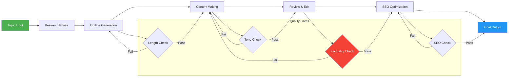
```mermaid
graph LR
    A[Topic Input] --> B[Research Phase]
    B --> C[Outline Generation]
    C --> D[Content Writing]
    D --> E[Review & Edit]
    E --> F[SEO Optimization]
    F --> G[Final Output]

    subgraph "Quality Gates"
        H{Length Check}
        I{Tone Check}
        J{Factuality Check}
        K{SEO Check}
    end

    C --> H
    D --> I
    E --> J
    F --> K

    H -->|Pass| D
    H -->|Fail| C
    I -->|Pass| E
    I -->|Fail| D
    J -->|Pass| F
    J -->|Fail| D
    K -->|Pass| G
    K -->|Fail| F

    style A fill:#4CAF50,color:#fff
    style G fill:#2196F3,color:#fff
    style J fill:#F44336,color:#fff
```

---

## Integration Ecosystem

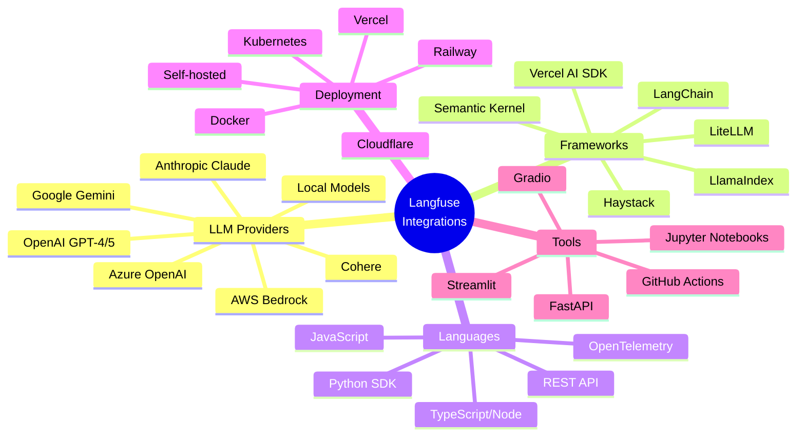
```mermaid
mindmap
  root((Langfuse<br/>Integrations))
    LLM Providers
      OpenAI GPT-4/5
      Anthropic Claude
      Google Gemini
      Azure OpenAI
      AWS Bedrock
      Cohere
      Local Models
    Frameworks
      LangChain
      LlamaIndex
      Haystack
      Semantic Kernel
      Vercel AI SDK
      LiteLLM
    Languages
      Python SDK
      TypeScript/Node
      JavaScript
      REST API
      OpenTelemetry
    Deployment
      Docker
      Kubernetes
      Vercel
      Railway
      Cloudflare
      Self-hosted
    Tools
      GitHub Actions
      Jupyter Notebooks
      Streamlit
      Gradio
      FastAPI
```

---

## Prompt Management Workflow

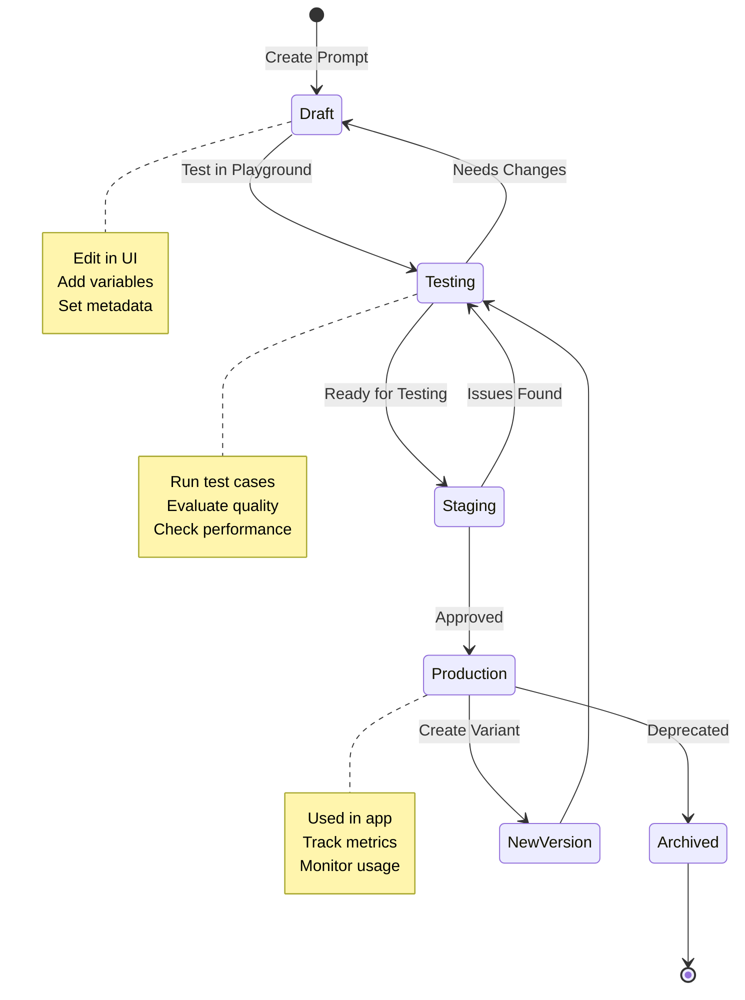
```mermaid
stateDiagram-v2
    [*] --> Draft: Create Prompt
    Draft --> Testing: Test in Playground
    Testing --> Draft: Needs Changes
    Testing --> Staging: Ready for Testing
    Staging --> Testing: Issues Found
    Staging --> Production: Approved
    Production --> Archived: Deprecated
    Production --> NewVersion: Create Variant

    NewVersion --> Testing
    Archived --> [*]

    note right of Draft
        Edit in UI
        Add variables
        Set metadata
    end note

    note right of Testing
        Run test cases
        Evaluate quality
        Check performance
    end note

    note right of Production
        Used in app
        Track metrics
        Monitor usage
    end note
```

---

## Evaluation Framework

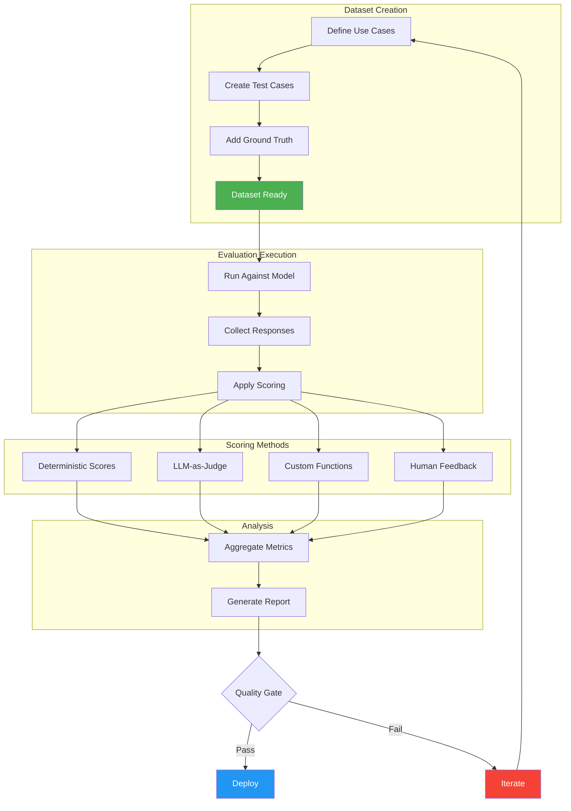
```mermaid
graph TB
    subgraph "Dataset Creation"
        A[Define Use Cases] --> B[Create Test Cases]
        B --> C[Add Ground Truth]
        C --> D[Dataset Ready]
    end

    subgraph "Evaluation Execution"
        D --> E[Run Against Model]
        E --> F[Collect Responses]
        F --> G[Apply Scoring]
    end

    subgraph "Scoring Methods"
        G --> H[Deterministic Scores]
        G --> I[LLM-as-Judge]
        G --> J[Custom Functions]
        G --> K[Human Feedback]
    end

    subgraph "Analysis"
        H --> L[Aggregate Metrics]
        I --> L
        J --> L
        K --> L
        L --> M[Generate Report]
    end

    M --> N{Quality Gate}
    N -->|Pass| O[Deploy]
    N -->|Fail| P[Iterate]
    P --> A

    style D fill:#4CAF50,color:#fff
    style O fill:#2196F3,color:#fff
    style P fill:#F44336,color:#fff
```

---

## Cost & Token Tracking

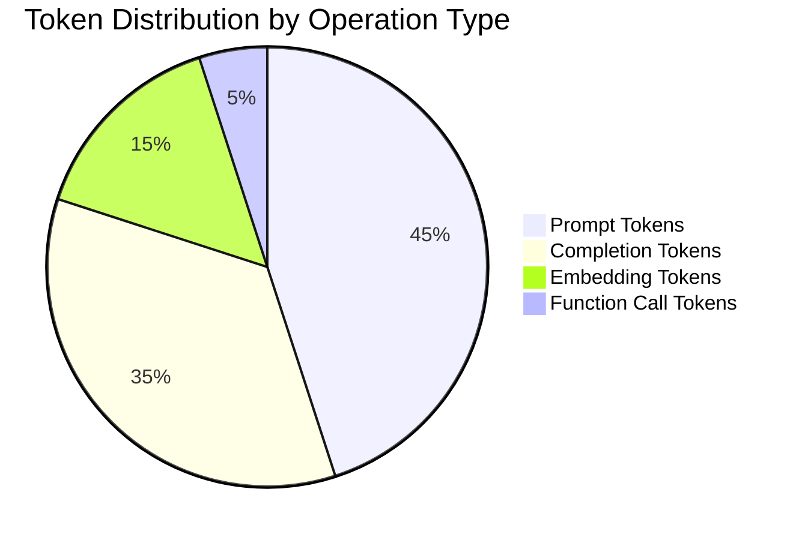
```mermaid
pie title Token Distribution by Operation Type
    "Prompt Tokens" : 45
    "Completion Tokens" : 35
    "Embedding Tokens" : 15
    "Function Call Tokens" : 5
```

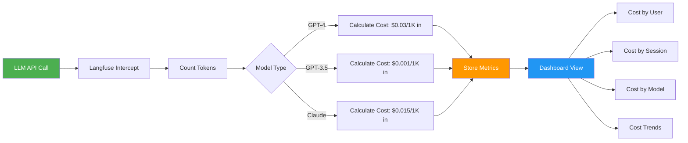
```mermaid
graph LR
    A[LLM API Call] --> B[Langfuse Intercept]
    B --> C[Count Tokens]
    C --> D{Model Type}

    D -->|GPT-4| E[Calculate Cost: $0.03/1K in]
    D -->|GPT-3.5| F[Calculate Cost: $0.001/1K in]
    D -->|Claude| G[Calculate Cost: $0.015/1K in]

    E --> H[Store Metrics]
    F --> H
    G --> H

    H --> I[Dashboard View]
    I --> J[Cost by User]
    I --> K[Cost by Session]
    I --> L[Cost by Model]
    I --> M[Cost Trends]

    style A fill:#4CAF50,color:#fff
    style H fill:#FF9800,color:#fff
    style I fill:#2196F3,color:#fff
```

---

## Multi-Model Comparison

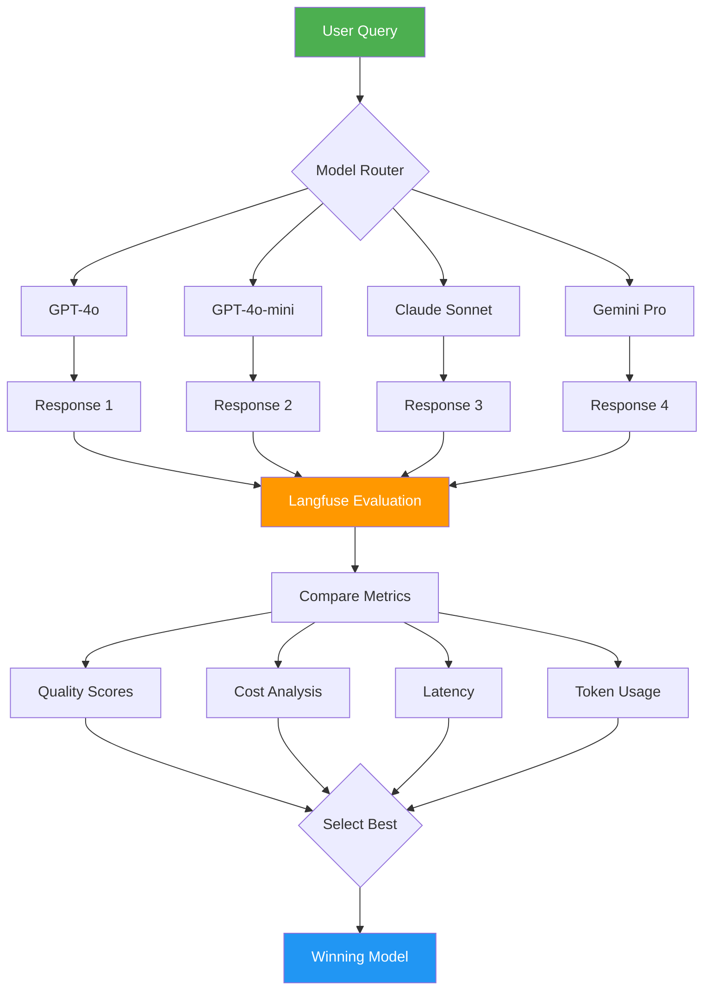
```mermaid
graph TB
    Query[User Query] --> Router{Model Router}

    Router --> M1[GPT-4o]
    Router --> M2[GPT-4o-mini]
    Router --> M3[Claude Sonnet]
    Router --> M4[Gemini Pro]

    M1 --> R1[Response 1]
    M2 --> R2[Response 2]
    M3 --> R3[Response 3]
    M4 --> R4[Response 4]

    R1 --> Eval[Langfuse Evaluation]
    R2 --> Eval
    R3 --> Eval
    R4 --> Eval

    Eval --> Metrics[Compare Metrics]

    Metrics --> Quality[Quality Scores]
    Metrics --> Cost[Cost Analysis]
    Metrics --> Speed[Latency]
    Metrics --> Tokens[Token Usage]

    Quality --> Decision{Select Best}
    Cost --> Decision
    Speed --> Decision
    Tokens --> Decision

    Decision --> Winner[Winning Model]

    style Query fill:#4CAF50,color:#fff
    style Eval fill:#FF9800,color:#fff
    style Winner fill:#2196F3,color:#fff
```

---

## Deployment Patterns

### Cloud Hosted (SaaS)

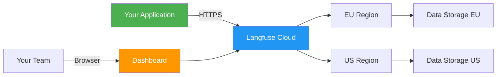
```mermaid
graph LR
    A[Your Application] -->|HTTPS| B[Langfuse Cloud]
    B --> C[EU Region]
    B --> D[US Region]

    C --> E[Data Storage EU]
    D --> F[Data Storage US]

    G[Your Team] -->|Browser| H[Dashboard]
    H --> B

    style A fill:#4CAF50,color:#fff
    style B fill:#2196F3,color:#fff
    style H fill:#FF9800,color:#fff
```

### Self-Hosted

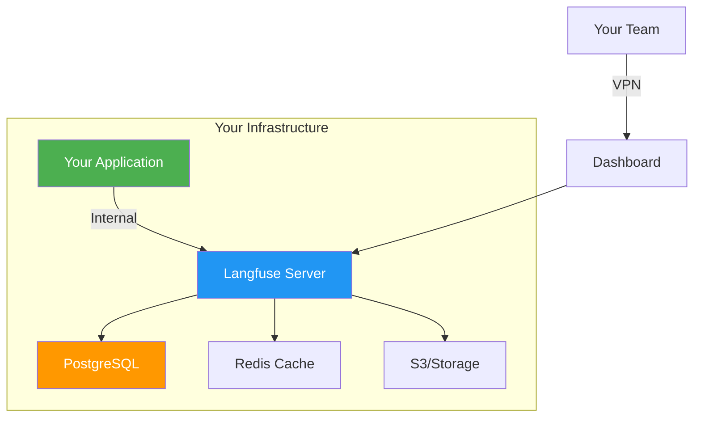
```mermaid
graph TB
    subgraph "Your Infrastructure"
        A[Your Application]
        B[Langfuse Server]
        C[PostgreSQL]
        D[Redis Cache]
        E[S3/Storage]

        A -->|Internal| B
        B --> C
        B --> D
        B --> E
    end

    F[Your Team] -->|VPN| G[Dashboard]
    G --> B

    style A fill:#4CAF50,color:#fff
    style B fill:#2196F3,color:#fff
    style C fill:#FF9800,color:#fff
```

---

## Security & Compliance

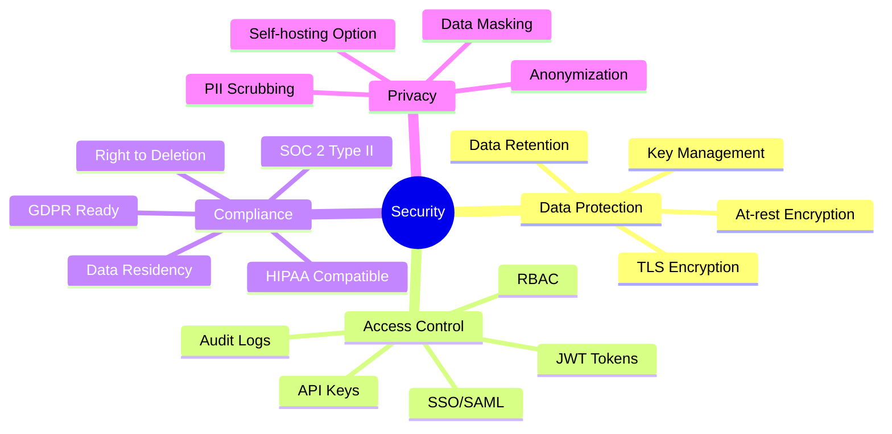
```mermaid
mindmap
  root((Security))
    Data Protection
      TLS Encryption
      At-rest Encryption
      Key Management
      Data Retention
    Access Control
      API Keys
      JWT Tokens
      RBAC
      SSO/SAML
      Audit Logs
    Compliance
      GDPR Ready
      SOC 2 Type II
      HIPAA Compatible
      Data Residency
      Right to Deletion
    Privacy
      Self-hosting Option
      PII Scrubbing
      Data Masking
      Anonymization
```

---

## Performance Metrics

### Overhead Impact

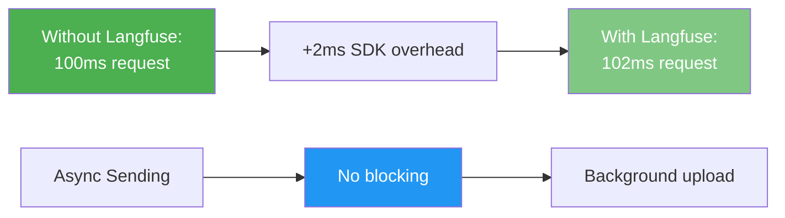
```mermaid
graph LR
    A[Without Langfuse:<br/>100ms request] --> B[+2ms SDK overhead]
    B --> C[With Langfuse:<br/>102ms request]

    D[Async Sending] --> E[No blocking]
    E --> F[Background upload]

    style A fill:#4CAF50,color:#fff
    style C fill:#81C784,color:#fff
    style E fill:#2196F3,color:#fff
```

### Scale Characteristics

| Metric | Value | Notes |
|--------|-------|-------|
| SDK Overhead | 1-3ms | Async, non-blocking |
| Max Events/sec | 10,000+ | With batching |
| Storage per Trace | 1-10 KB | Depends on metadata |
| Dashboard Latency | <200ms | Global CDN |
| API Response Time | <100ms | P95 percentile |

---

## Quick Start Flow

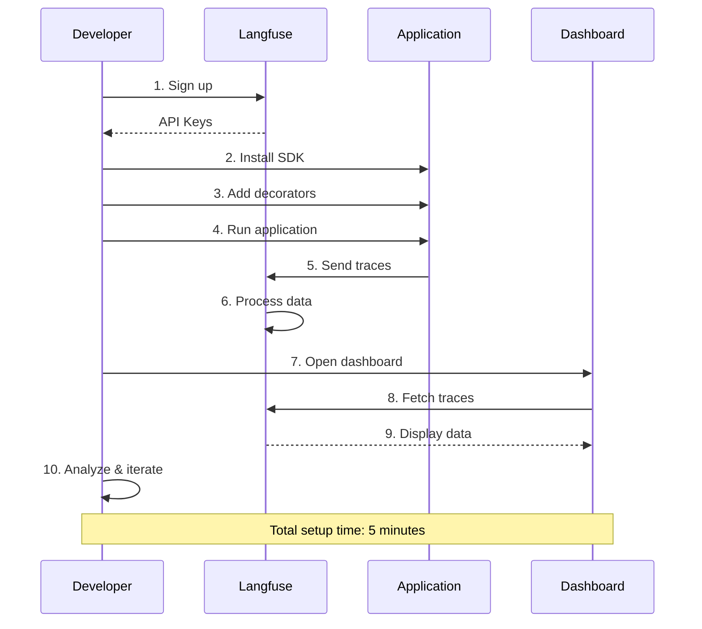
```mermaid
sequenceDiagram
    participant Dev as Developer
    participant LF as Langfuse
    participant App as Application
    participant Dash as Dashboard

    Dev->>LF: 1. Sign up
    LF-->>Dev: API Keys

    Dev->>App: 2. Install SDK
    Dev->>App: 3. Add decorators
    Dev->>App: 4. Run application

    App->>LF: 5. Send traces
    LF->>LF: 6. Process data

    Dev->>Dash: 7. Open dashboard
    Dash->>LF: 8. Fetch traces
    LF-->>Dash: 9. Display data

    Dev->>Dev: 10. Analyze & iterate

    Note over Dev,Dash: Total setup time: 5 minutes
```

---

## Feature Comparison

### Langfuse vs Alternatives

| Feature | Langfuse | LangSmith | Weights & Biases | Phoenix | PromptLayer |
|---------|----------|-----------|------------------|---------|-------------|
| **Open Source** | Yes (MIT) | No | Partial | Yes | No |
| **Self-Hosting** | Yes | No | No | Yes | No |
| **Prompt Management** | Yes | Yes | No | No | Limited |
| **LLM Tracing** | Yes | Yes | Yes | Yes | Yes |
| **Cost Tracking** | Automatic | Automatic | Manual | No | Automatic |
| **Evaluations** | Yes | Yes | Yes | Limited | No |
| **Free Tier** | 50k obs/mo | Limited | Limited | Unlimited | 1k requests/mo |
| **Multi-Provider** | All major | Limited | All major | All major | All major |
| **Team Collaboration** | Yes | Yes | Yes | No | Yes |
| **API Access** | Full REST API | Limited | Full | Limited | Limited |
| **Custom Scores** | Yes | Yes | Yes | No | No |
| **Data Retention** | Unlimited | 14 days | Varies | Self-managed | 30 days |

### When to Choose Langfuse

**Choose Langfuse if you need:**
- Open-source solution with self-hosting option
- Complete data ownership and privacy
- Prompt management with version control
- Comprehensive cost tracking
- Flexible evaluation framework
- Long-term data retention
- No vendor lock-in

**Choose Alternatives if:**
- LangSmith: Deeply integrated with LangChain ecosystem only
- W&B: Need ML experiment tracking beyond LLMs
- Phoenix: Require only basic open-source tracing
- PromptLayer: Simple logging with minimal features

---

## Pricing Tiers

| Tier | Price | Observations/Month | Features |
|------|-------|-------------------|----------|
| **Hobby** | Free | 50,000 | All core features, 1 project |
| **Pro** | $59/mo | 500,000 | 5 projects, team collaboration |
| **Team** | $299/mo | 5,000,000 | Unlimited projects, SSO, SLA |
| **Enterprise** | Custom | Unlimited | Self-hosted, dedicated support |

**Note**: This pilot uses the free Hobby tier (50k observations/month).

---

## Implementation Roadmap

### Phase 1: Proof of Concept (Week 1)
- Set up Langfuse account
- Run pilot examples
- Explore dashboard
- Identify use cases

### Phase 2: Integration (Weeks 2-3)
- Instrument existing application
- Set up prompt management
- Create evaluation datasets
- Configure team access

### Phase 3: Optimization (Weeks 4-6)
- Analyze traces and metrics
- Optimize prompts based on data
- Reduce costs through insights
- Improve quality scores

### Phase 4: Production (Week 7+)
- Deploy to production
- Set up monitoring and alerts
- Continuous evaluation
- Scale across organization

---

## Success Metrics

**Operational Metrics:**
- 50% reduction in debugging time
- 30-40% reduction in API costs
- 95%+ uptime monitoring
- <5 minute incident detection

**Quality Metrics:**
- 20% improvement in response quality
- 80%+ evaluation coverage
- <5% regression rate
- 90%+ user satisfaction

**Adoption Metrics:**
- 100% of LLM features traced
- 10+ active team members
- 50+ prompt versions managed
- 1000+ evaluation runs/month

---

## Documentation Resources

- **QUICKSTART.md**: 5-minute getting started guide
- **README.md**: Complete pilot project documentation
- **TECHNICAL_DOCUMENTATION.md**: Deep technical reference
- **DOCUMENTATION_INDEX.md**: Navigation guide

**External Resources:**
- Official Docs: https://langfuse.com/docs
- GitHub: https://github.com/langfuse/langfuse
- Discord: https://discord.langfuse.com
- Blog: https://langfuse.com/blog

---

## Conclusion

```mermaid
mindmap
  root((Why Langfuse?))
    Developer Experience
      5-min setup
      Zero-code instrumentation
      Beautiful UI
      Comprehensive docs
    Open Source
      MIT License
      Self-hostable
      Community driven
      Full transparency
    Production Ready
      Battle tested
      High performance
      Scalable
      Enterprise support
    Complete Platform
      Tracing + Prompts + Evals
      All LLM providers
      Full feature set
      Continuous innovation
    Cost Effective
      Free tier: 50k/mo
      Automatic cost tracking
      Optimization insights
      No hidden fees
```

**Langfuse brings production-grade observability and engineering practices to LLM applications, enabling teams to build, debug, and optimize AI features with confidence.**

---

**Version:** 1.0 | **Date:** January 2026 | **Langfuse SDK:** v2.x
