# Langfuse - Comprehensive Technical Documentation

**Version:** 3.0
**Last Updated:** January 2026
**Official Site:** https://langfuse.com/

---

## Table of Contents

1. [Product Overview](#product-overview)
2. [Core Architecture](#core-architecture)
3. [Feature Deep Dive](#feature-deep-dive)
4. [Installation and Setup](#installation-and-setup)
5. [SDK Documentation](#sdk-documentation)
6. [Tracing and Observability](#tracing-and-observability)
7. [Prompt Management](#prompt-management)
8. [Evaluation Framework](#evaluation-framework)
9. [Dataset Management](#dataset-management)
10. [Integrations](#integrations)
11. [Analytics and Metrics](#analytics-and-metrics)
12. [API Reference](#api-reference)
13. [Best Practices](#best-practices)
14. [Performance and Scaling](#performance-and-scaling)
15. [Comparison and Alternatives](#comparison-and-alternatives)
16. [Appendix](#appendix)

---

## Product Overview

### What is Langfuse?

Langfuse is an **open-source LLM engineering platform** that provides comprehensive observability, analytics, prompt management, and evaluation capabilities for production LLM applications. It enables engineering teams to monitor, debug, and improve their LLM applications at scale.

### Key Value Propositions

| Feature | Benefit |
|---------|---------|
| **Production Observability** | Complete trace visibility across distributed LLM systems |
| **Open-Source Core** | Self-hostable with full control over data and infrastructure |
| **Framework Agnostic** | Native integrations with LangChain, LlamaIndex, OpenAI SDK, Vercel AI |
| **Scalable Architecture** | ClickHouse-powered analytics for billions of events |
| **Prompt Management** | Version-controlled prompt templates with environment deployments |
| **Flexible Evaluation** | Code-based, model-based, and human-in-the-loop evaluation methods |

### Platform Philosophy

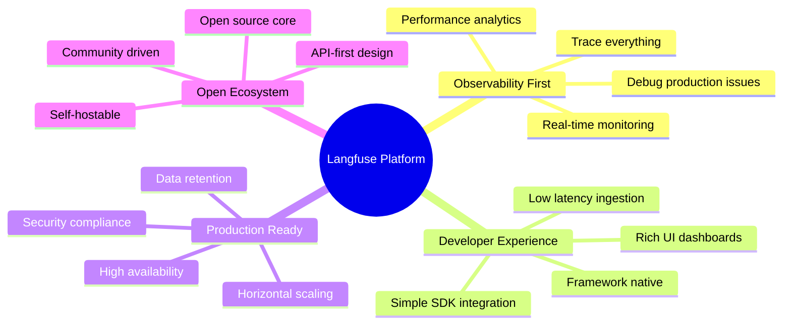

### Primary Use Cases

```mermaid
flowchart TB
    A[Langfuse Platform] --> B[Development]
    A --> C[Production]
    A --> D[Optimization]
    A --> E[Compliance]

    B --> B1[Prototype Debugging]
    B --> B2[Prompt Engineering]
    B --> B3[Chain Development]
    B --> B4[Integration Testing]

    C --> C1[Real-time Monitoring]
    C --> C2[Error Tracking]
    C --> C3[Performance Metrics]
    C --> C4[User Analytics]

    D --> D1[Cost Optimization]
    D --> D2[Latency Reduction]
    D --> D3[Quality Improvement]
    D --> D4[A/B Testing]

    E --> E1[Audit Trails]
    E --> E2[Data Governance]
    E --> E3[Usage Reporting]
    E --> E4[Security Monitoring]

    style A fill:#4A90E2,color:#fff
    style B fill:#7ED321,color:#fff
    style C fill:#F5A623,color:#fff
    style D fill:#BD10E0,color:#fff
    style E fill:#50E3C2,color:#fff
```

### Target User Personas

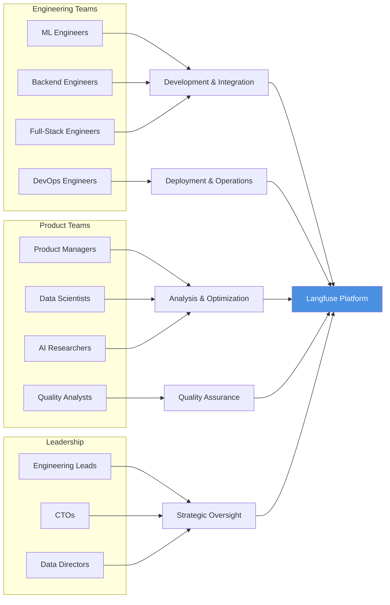

### Fundamental Workflow

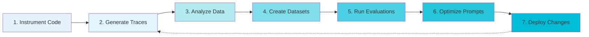

---

## Core Architecture

### System Architecture Overview (v3)

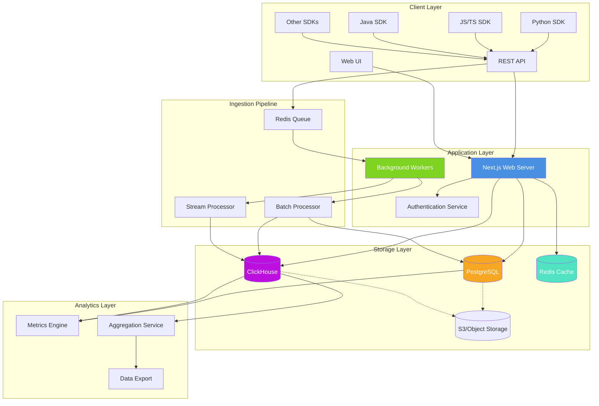

### Data Flow Architecture

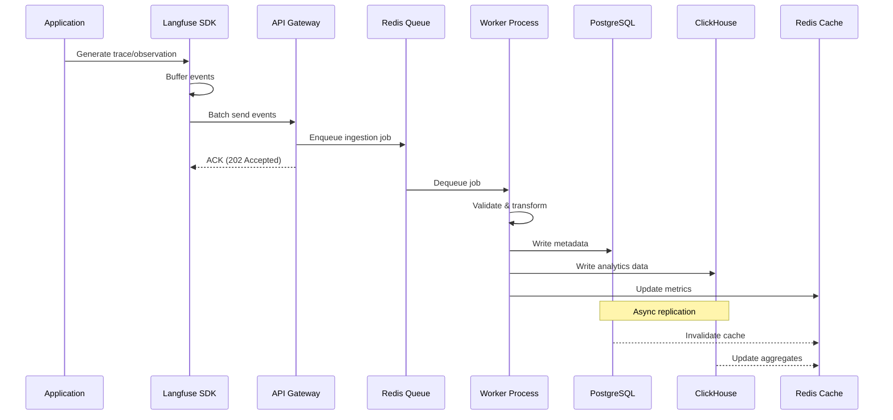

### Data Model Hierarchy

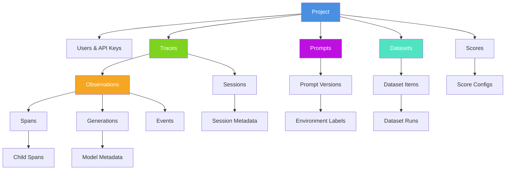

### Trace Ingestion Sequence

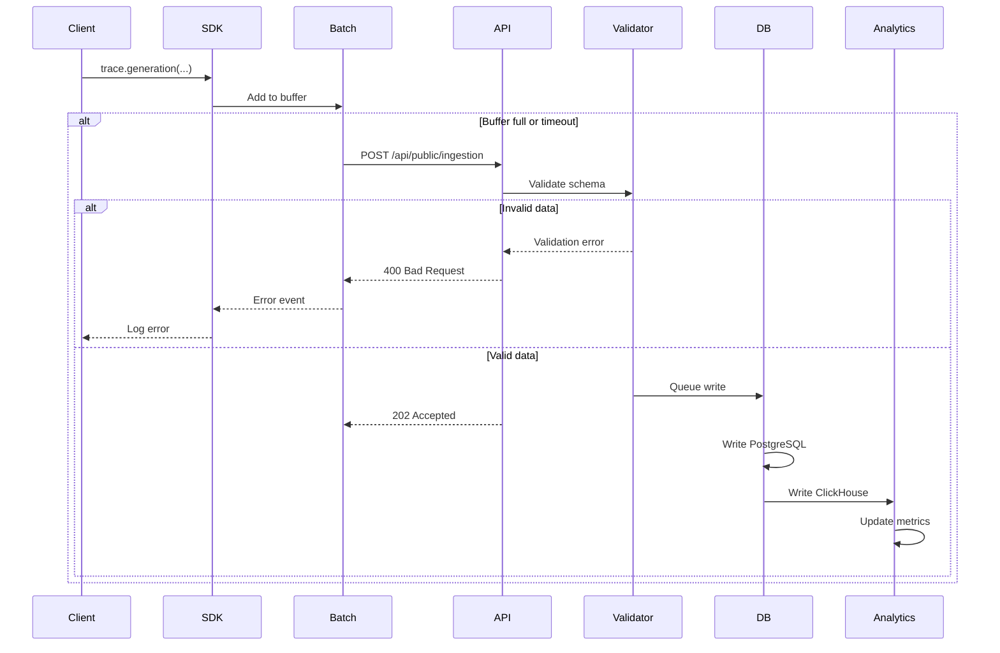

### Storage Architecture

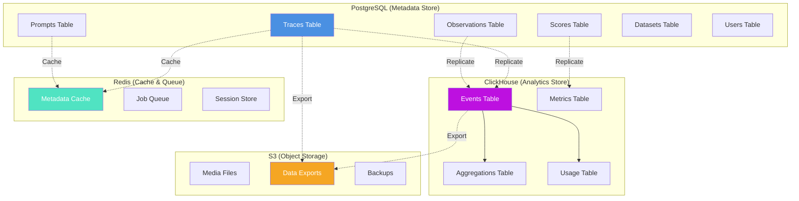

### Microservices Architecture

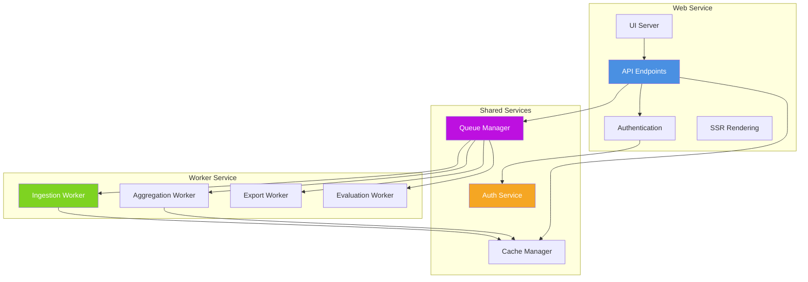

### Deployment Architecture

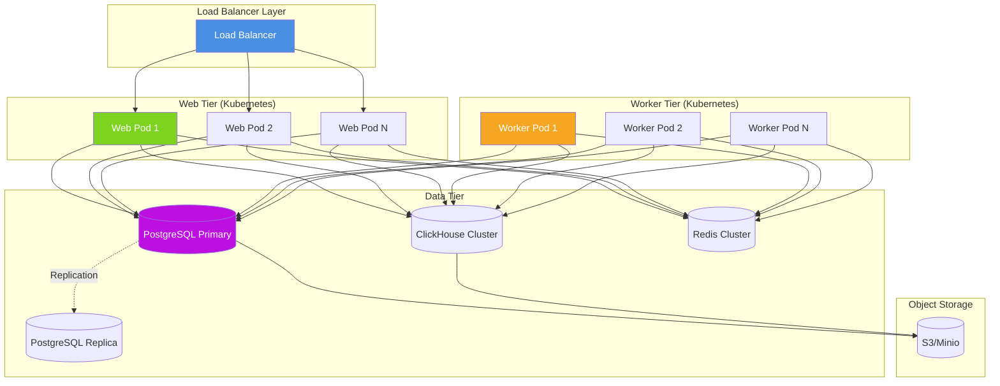

---

## Feature Deep Dive

### Core Feature Set

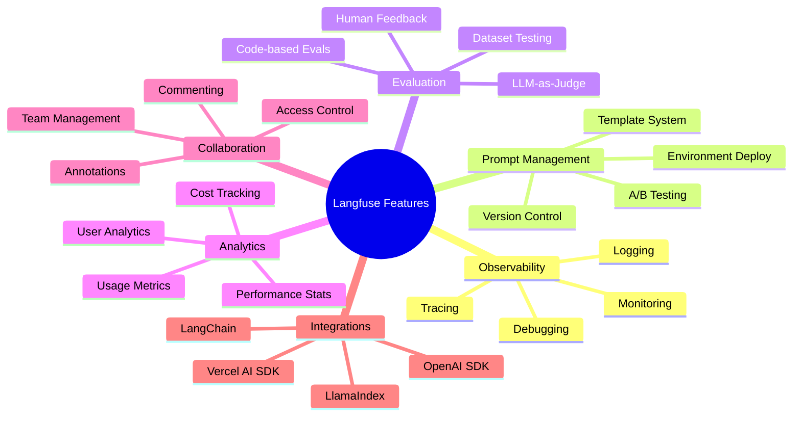

### Tracing and Observability

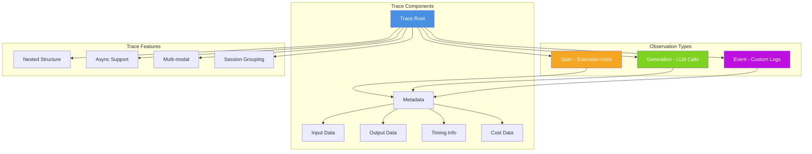

### Observation Type Hierarchy

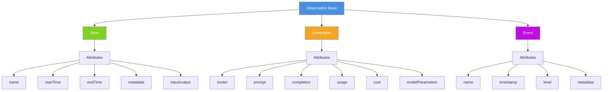

### Prompt Management Workflow

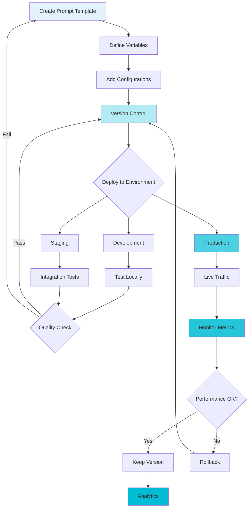

### Evaluation Methods

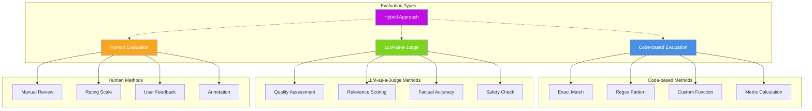

### Analytics and Metrics

```mermaid
graph TB
    subgraph "Metric Categories"
        USAGE[Usage Metrics]
        PERF[Performance Metrics]
        COST[Cost Metrics]
        QUALITY[Quality Metrics]
    end

    subgraph "Usage Analytics"
        USAGE_COUNT[Request Count]
        USAGE_USER[Active Users]
        USAGE_SESSION[Session Count]
        USAGE_TRACE[Trace Volume]
    end

    subgraph "Performance Analytics"
        PERF_LATENCY[Latency Distribution]
        PERF_THROUGHPUT[Throughput]
        PERF_ERROR[Error Rate]
        PERF_P99[P99 Latency]
    end

    subgraph "Cost Analytics"
        COST_TOKEN[Token Usage]
        COST_MODEL[Model Costs]
        COST_USER[Cost per User]
        COST_TREND[Cost Trends]
    end

    subgraph "Quality Analytics"
        QUALITY_SCORE[Score Distribution]
        QUALITY_FEEDBACK[User Feedback]
        QUALITY_SUCCESS[Success Rate]
        QUALITY_EVAL[Evaluation Results]
    end

    USAGE --> USAGE_COUNT
    USAGE --> USAGE_USER
    USAGE --> USAGE_SESSION
    USAGE --> USAGE_TRACE

    PERF --> PERF_LATENCY
    PERF --> PERF_THROUGHPUT
    PERF --> PERF_ERROR
    PERF --> PERF_P99

    COST --> COST_TOKEN
    COST --> COST_MODEL
    COST --> COST_USER
    COST --> COST_TREND

    QUALITY --> QUALITY_SCORE
    QUALITY --> QUALITY_FEEDBACK
    QUALITY --> QUALITY_SUCCESS
    QUALITY --> QUALITY_EVAL

    style USAGE fill:#4A90E2,color:#fff
    style PERF fill:#7ED321,color:#fff
    style COST fill:#F5A623,color:#fff
    style QUALITY fill:#BD10E0,color:#fff
```

---

## Installation and Setup

### Deployment Options Comparison

| Feature | Cloud (Managed) | Self-Hosted (Docker) | Self-Hosted (Kubernetes) |
|---------|----------------|----------------------|--------------------------|
| **Setup Time** | < 5 minutes | 15-30 minutes | 1-2 hours |
| **Infrastructure Management** | Fully managed | Manual | Manual |
| **Scaling** | Automatic | Manual | Automatic |
| **Data Location** | Langfuse servers | Your infrastructure | Your infrastructure |
| **Updates** | Automatic | Manual | Manual |
| **Cost** | Usage-based pricing | Infrastructure costs | Infrastructure costs |
| **Support** | Enterprise support available | Community | Community |
| **Custom Domain** | Available | Full control | Full control |
| **SSO/SAML** | Enterprise plan | Available | Available |
| **High Availability** | Built-in | Manual setup | Configuration required |
| **Recommended For** | Quick start, teams | Small deployments | Production at scale |

### Setup Decision Flowchart

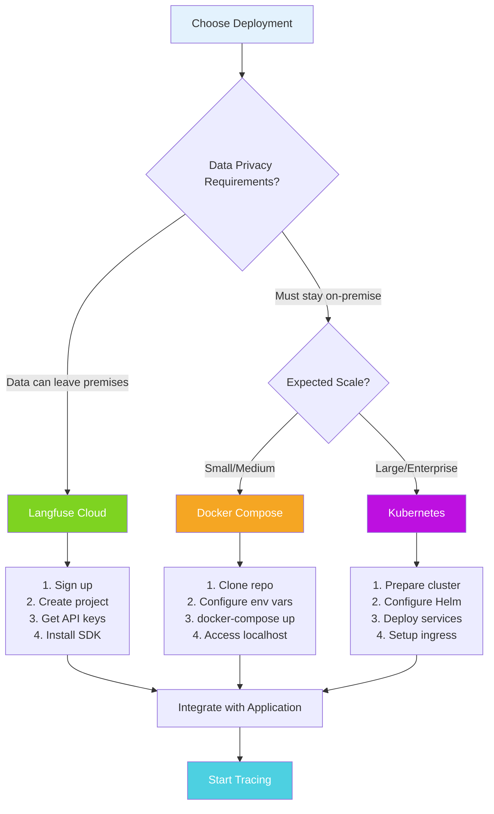

### Cloud Setup Process

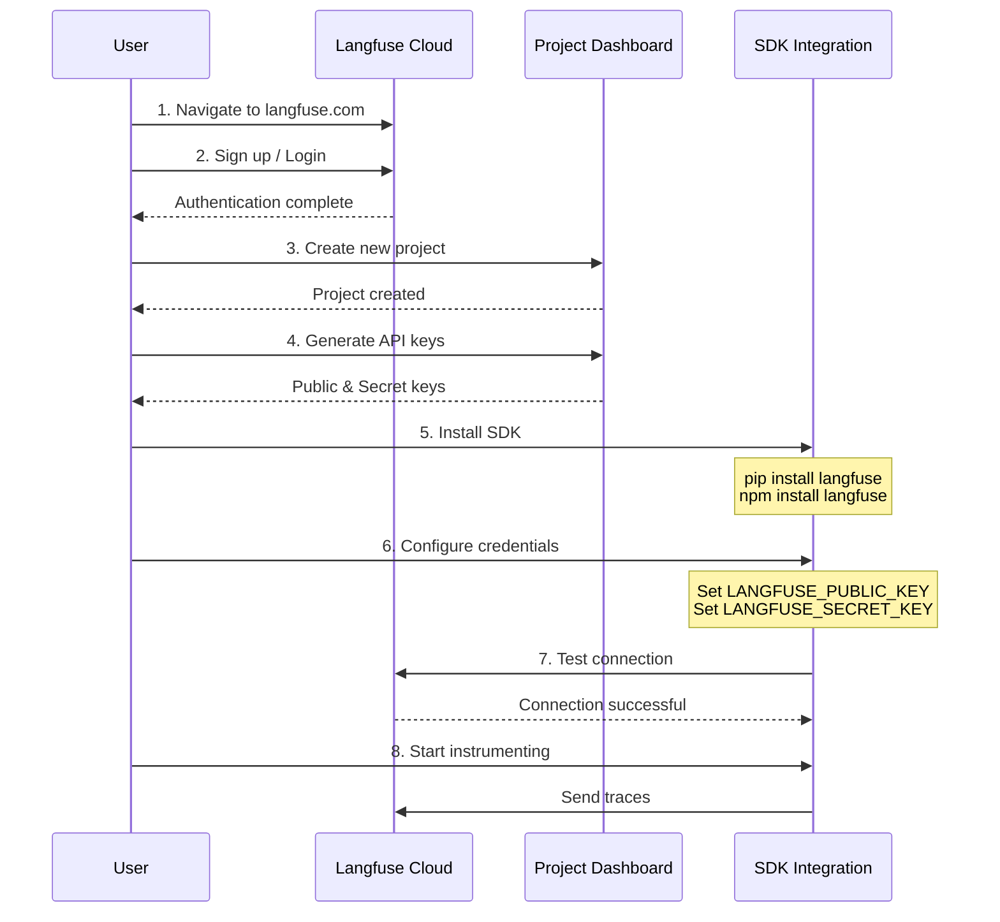

### Self-Hosted Docker Setup

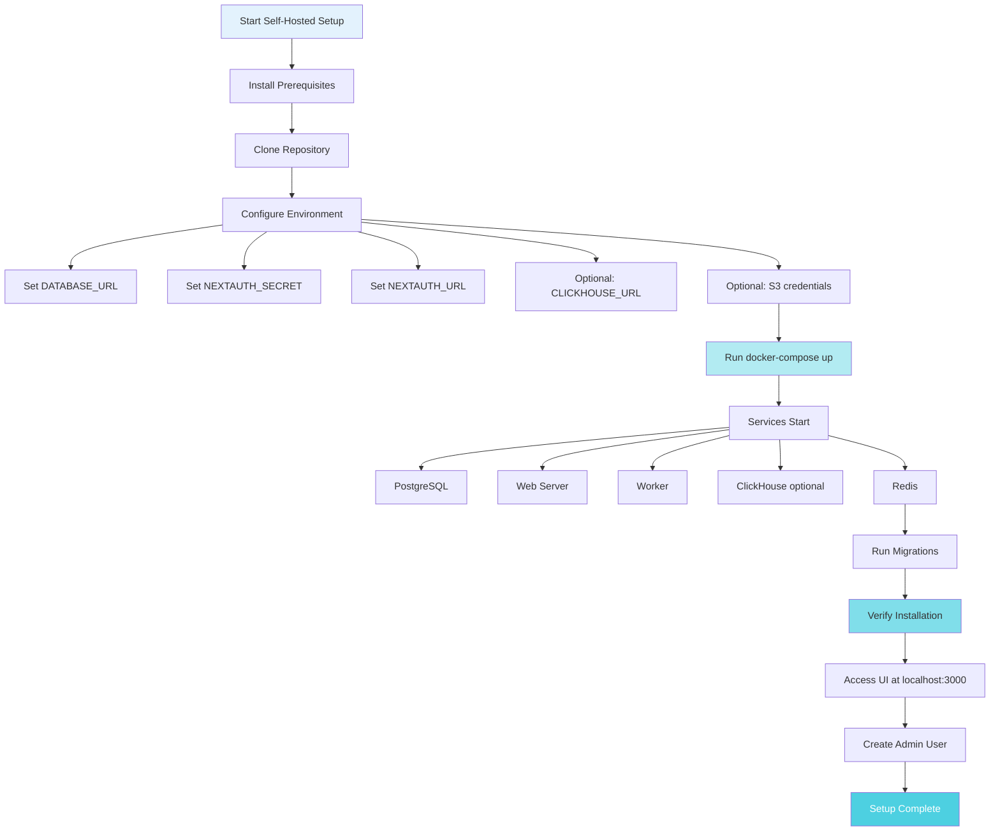

### Kubernetes Deployment Architecture

```mermaid
graph TB
    subgraph "Ingress Layer"
        INGRESS[Nginx Ingress]
        CERT[Cert Manager]
    end

    subgraph "Application Namespace"
        WEB_DEPLOY[Web Deployment]
        WORKER_DEPLOY[Worker Deployment]
        WEB_SVC[Web Service]

        WEB_HPA[Web HPA]
        WORKER_HPA[Worker HPA]
    end

    subgraph "Data Namespace"
        PG_STATEFUL[PostgreSQL StatefulSet]
        REDIS_STATEFUL[Redis StatefulSet]
        CH_STATEFUL[ClickHouse StatefulSet]

        PG_PVC[PostgreSQL PVC]
        REDIS_PVC[Redis PVC]
        CH_PVC[ClickHouse PVC]
    end

    subgraph "Secrets & Config"
        SECRET[Secrets]
        CONFIGMAP[ConfigMaps]
    end

    INGRESS --> WEB_SVC
    WEB_SVC --> WEB_DEPLOY

    WEB_HPA -.Scales.-> WEB_DEPLOY
    WORKER_HPA -.Scales.-> WORKER_DEPLOY

    WEB_DEPLOY --> SECRET
    WEB_DEPLOY --> CONFIGMAP
    WORKER_DEPLOY --> SECRET
    WORKER_DEPLOY --> CONFIGMAP

    WEB_DEPLOY --> PG_STATEFUL
    WEB_DEPLOY --> REDIS_STATEFUL
    WEB_DEPLOY --> CH_STATEFUL

    WORKER_DEPLOY --> PG_STATEFUL
    WORKER_DEPLOY --> REDIS_STATEFUL
    WORKER_DEPLOY --> CH_STATEFUL

    PG_STATEFUL --> PG_PVC
    REDIS_STATEFUL --> REDIS_PVC
    CH_STATEFUL --> CH_PVC

    style INGRESS fill:#4A90E2,color:#fff
    style WEB_DEPLOY fill:#7ED321,color:#fff
    style PG_STATEFUL fill:#F5A623,color:#fff
```

### SDK Installation by Language

```mermaid
graph LR
    subgraph "Python"
        PY1[pip install langfuse]
        PY2[poetry add langfuse]
        PY3[conda install langfuse]
    end

    subgraph "JavaScript/TypeScript"
        JS1[npm install langfuse]
        JS2[yarn add langfuse]
        JS3[pnpm add langfuse]
    end

    subgraph "Java"
        JAVA1[Maven dependency]
        JAVA2[Gradle dependency]
    end

    subgraph "Other Languages"
        OTHER1[HTTP API directly]
        OTHER2[Community SDKs]
    end

    INSTALL[Choose SDK] --> PY1
    INSTALL --> JS1
    INSTALL --> JAVA1
    INSTALL --> OTHER1

    style INSTALL fill:#4A90E2,color:#fff
    style PY1 fill:#7ED321,color:#fff
    style JS1 fill:#F5A623,color:#fff
    style JAVA1 fill:#BD10E0,color:#fff
```

---

## SDK Documentation

### Available SDKs

```mermaid
graph TB
    subgraph "Official SDKs"
        PYTHON[Python SDK]
        NODEJS[JavaScript/TypeScript SDK]
        JAVA[Java SDK]
    end

    subgraph "Framework Integrations"
        LANGCHAIN[LangChain]
        LLAMAINDEX[LlamaIndex]
        OPENAI[OpenAI SDK]
        VERCEL[Vercel AI SDK]
        LITELLM[LiteLLM]
    end

    subgraph "API Access"
        REST[REST API]
        GRAPHQL[GraphQL API]
    end

    PYTHON --> FEATURES1[Full feature support]
    NODEJS --> FEATURES2[Full feature support]
    JAVA --> FEATURES3[Full feature support]

    LANGCHAIN --> PYTHON
    LLAMAINDEX --> PYTHON
    OPENAI --> PYTHON & NODEJS
    VERCEL --> NODEJS

    REST --> FEATURES4[Language agnostic]
    GRAPHQL --> FEATURES5[Advanced queries]

    style PYTHON fill:#4A90E2,color:#fff
    style NODEJS fill:#7ED321,color:#fff
    style JAVA fill:#F5A623,color:#fff
    style REST fill:#BD10E0,color:#fff
```

### Python SDK Architecture

```mermaid
graph TB
    subgraph "Core Components"
        CLIENT[Langfuse Client]
        TRACE[Trace Object]
        OBS[Observation Object]
        BATCH[Batch Manager]
    end

    subgraph "Integration Methods"
        DECORATOR[Decorators]
        CONTEXT[Context Managers]
        MANUAL[Manual Instrumentation]
    end

    subgraph "Framework Integrations"
        LC_CALLBACK[LangChain Callback]
        LLAMA_CALLBACK[LlamaIndex Callback]
        OPENAI_WRAPPER[OpenAI Wrapper]
    end

    subgraph "Transport Layer"
        QUEUE[Event Queue]
        HTTP[HTTP Client]
        RETRY[Retry Logic]
    end

    CLIENT --> TRACE
    TRACE --> OBS
    CLIENT --> BATCH

    DECORATOR --> TRACE
    CONTEXT --> TRACE
    MANUAL --> TRACE

    LC_CALLBACK --> CLIENT
    LLAMA_CALLBACK --> CLIENT
    OPENAI_WRAPPER --> CLIENT

    BATCH --> QUEUE
    QUEUE --> HTTP
    HTTP --> RETRY

    style CLIENT fill:#4A90E2,color:#fff
    style TRACE fill:#7ED321,color:#fff
    style BATCH fill:#F5A623,color:#fff
```

### SDK Integration Methods

```mermaid
flowchart TB
    APP[Application Code] --> METHOD{Choose Method}

    METHOD --> M1[Decorator-based]
    METHOD --> M2[Context Manager]
    METHOD --> M3[Manual SDK]
    METHOD --> M4[Framework Native]

    M1 --> D1[Python: @observe]
    M1 --> D2[Minimal code changes]
    M1 --> D3[Automatic tracing]

    M2 --> C1[with statement]
    C2 --> C2[Fine-grained control]
    C2 --> C3[Explicit boundaries]

    M3 --> S1[Full API access]
    M3 --> S2[Maximum flexibility]
    M3 --> S3[Complex workflows]

    M4 --> F1[LangChain callback]
    M4 --> F2[LlamaIndex callback]
    M4 --> F3[Zero code changes]

    style METHOD fill:#4A90E2,color:#fff
    style M1 fill:#7ED321,color:#fff
    style M2 fill:#F5A623,color:#fff
    style M3 fill:#BD10E0,color:#fff
    style M4 fill:#50E3C2,color:#fff
```

### Decorator Pattern Usage

```mermaid
sequenceDiagram
    participant App as Application
    participant Dec as @observe Decorator
    participant SDK as Langfuse SDK
    participant API as Langfuse API

    App->>Dec: Call decorated function
    Dec->>SDK: Create trace/span
    Dec->>App: Execute function

    App-->>Dec: Return result
    Dec->>SDK: Capture output
    Dec->>SDK: Record timing

    SDK->>SDK: Add to batch

    alt Batch threshold reached
        SDK->>API: Flush batch
        API-->>SDK: ACK
    end

    Dec-->>App: Return result
```

### Context Manager Pattern

```mermaid
sequenceDiagram
    participant App as Application
    participant CM as Context Manager
    participant Trace as Trace Object
    participant SDK as SDK Client

    App->>CM: Enter context (with)
    CM->>Trace: Create trace
    Trace->>SDK: Register trace

    App->>Trace: trace.span()
    Trace->>Trace: Create child span

    App->>Trace: trace.generation()
    Trace->>Trace: Create generation

    App->>Trace: Update metadata

    App->>CM: Exit context
    CM->>Trace: Finalize trace
    Trace->>SDK: Queue for sending

    SDK->>SDK: Batch and send
```

### Framework Integration Architecture

```mermaid
graph TB
    subgraph "LangChain Integration"
        LC_APP[LangChain App]
        LC_CALLBACK[CallbackHandler]
        LC_EVENTS[Chain Events]
    end

    subgraph "LlamaIndex Integration"
        LI_APP[LlamaIndex App]
        LI_CALLBACK[LlamaIndexCallbackHandler]
        LI_EVENTS[Query Events]
    end

    subgraph "OpenAI Integration"
        OAI_APP[OpenAI SDK]
        OAI_WRAPPER[Langfuse Wrapper]
        OAI_EVENTS[Completion Events]
    end

    subgraph "Langfuse Core"
        SDK[SDK Client]
        TRACE[Trace Manager]
        BATCH[Batch Processor]
    end

    LC_APP --> LC_CALLBACK
    LC_CALLBACK --> LC_EVENTS
    LC_EVENTS --> SDK

    LI_APP --> LI_CALLBACK
    LI_CALLBACK --> LI_EVENTS
    LI_EVENTS --> SDK

    OAI_APP --> OAI_WRAPPER
    OAI_WRAPPER --> OAI_EVENTS
    OAI_EVENTS --> SDK

    SDK --> TRACE
    TRACE --> BATCH

    style SDK fill:#4A90E2,color:#fff
    style LC_CALLBACK fill:#7ED321,color:#fff
    style LI_CALLBACK fill:#F5A623,color:#fff
    style OAI_WRAPPER fill:#BD10E0,color:#fff
```

### JavaScript/TypeScript SDK Features

```mermaid
graph TB
    subgraph "Core Features"
        TS_CLIENT[Langfuse Client]
        TS_TRACE[Trace Creation]
        TS_OBS[Observations]
        TS_BATCH[Batch Processing]
    end

    subgraph "Framework Support"
        NEXTJS[Next.js Integration]
        VERCEL[Vercel AI SDK]
        EXPRESS[Express.js]
        NODE[Node.js]
    end

    subgraph "TypeScript Features"
        TYPES[Full Type Definitions]
        ASYNC[Async/Await Support]
        PROMISE[Promise-based API]
        STREAM[Stream Processing]
    end

    TS_CLIENT --> TS_TRACE
    TS_TRACE --> TS_OBS
    TS_CLIENT --> TS_BATCH

    NEXTJS --> TS_CLIENT
    VERCEL --> TS_CLIENT
    EXPRESS --> TS_CLIENT
    NODE --> TS_CLIENT

    TS_CLIENT --> TYPES
    TS_CLIENT --> ASYNC
    TS_CLIENT --> PROMISE
    TS_CLIENT --> STREAM

    style TS_CLIENT fill:#4A90E2,color:#fff
    style NEXTJS fill:#7ED321,color:#fff
    style TYPES fill:#F5A623,color:#fff
```

---

## Tracing and Observability

### Trace Lifecycle

```mermaid
sequenceDiagram
    participant App as Application
    participant SDK as Langfuse SDK
    participant API as Ingestion API
    participant DB as Database
    participant UI as Web UI
    participant User as Developer

    App->>SDK: 1. Create trace
    SDK->>SDK: 2. Generate trace ID

    App->>SDK: 3. Add observations
    SDK->>SDK: 4. Buffer events

    App->>SDK: 5. Add metadata
    App->>SDK: 6. Record scores

    SDK->>API: 7. Flush batch
    API->>DB: 8. Persist data

    User->>UI: 9. View traces
    UI->>DB: 10. Query traces
    DB-->>UI: 11. Return data
    UI-->>User: 12. Display trace tree

    User->>UI: 13. Add annotation
    UI->>DB: 14. Update trace

    User->>UI: 15. Create dataset item
    UI->>DB: 16. Link to dataset
```

### Observation Types Deep Dive

```mermaid
mindmap
  root((Observations))
    Spans
      Purpose: Execution boundaries
      Use: Functions, API calls
      Attributes: name, start, end
      Nesting: Can contain children
    Generations
      Purpose: LLM interactions
      Use: Model completions
      Attributes: model, prompt, completion
      Tracking: Tokens, cost, latency
    Events
      Purpose: Point-in-time logs
      Use: Debug points, milestones
      Attributes: name, timestamp, level
      Flexibility: Custom metadata
```

### Three Instrumentation Methods

```mermaid
flowchart TB
    START[Choose Instrumentation] --> Q1{Framework in use?}

    Q1 -->|LangChain/LlamaIndex| NATIVE[Native Integration]
    Q1 -->|Custom code| Q2{Complexity level?}

    Q2 -->|Simple functions| DECORATOR[Decorator Pattern]
    Q2 -->|Complex workflows| Q3{Control needed?}

    Q3 -->|Automatic| CONTEXT[Context Manager]
    Q3 -->|Granular| MANUAL[Manual SDK]

    NATIVE --> N1[Import callback handler]
    N1 --> N2[Pass to framework]
    N2 --> N3[Automatic tracing]

    DECORATOR --> D1[Add @observe]
    D1 --> D2[Configure decorator]
    D2 --> D3[Auto trace creation]

    CONTEXT --> C1[with langfuse_context]
    C1 --> C2[Manual observations]
    C2 --> C3[Explicit control]

    MANUAL --> M1[Create client]
    M1 --> M2[Manage trace lifecycle]
    M2 --> M3[Full API access]

    style START fill:#E3F2FD
    style NATIVE fill:#7ED321,color:#fff
    style DECORATOR fill:#F5A623,color:#fff
    style MANUAL fill:#BD10E0,color:#fff
```

### Nested Trace Structure

```mermaid
graph TB
    TRACE[Trace: User Query]

    TRACE --> SPAN1[Span: Process Request]
    TRACE --> SPAN2[Span: Generate Response]
    TRACE --> SPAN3[Span: Post-process]

    SPAN1 --> GEN1[Generation: Embedding]
    SPAN1 --> SPAN1_1[Span: Vector Search]
    SPAN1 --> EVENT1[Event: Cache Hit]

    SPAN2 --> SPAN2_1[Span: Context Preparation]
    SPAN2 --> GEN2[Generation: LLM Call]
    SPAN2 --> EVENT2[Event: Token Count]

    SPAN2_1 --> EVENT3[Event: Prompt Template]
    SPAN2_1 --> SPAN2_1_1[Span: Prompt Formatting]

    GEN2 --> EVENT4[Event: Model Selected]
    GEN2 --> EVENT5[Event: Cost Calculated]

    SPAN3 --> SPAN3_1[Span: Format Output]
    SPAN3 --> EVENT6[Event: Response Validated]

    style TRACE fill:#4A90E2,color:#fff
    style SPAN1 fill:#7ED321,color:#fff
    style GEN1 fill:#F5A623,color:#fff
    style EVENT1 fill:#BD10E0,color:#fff
```

### Session Management

```mermaid
graph TB
    subgraph "Session Lifecycle"
        SESSION[Session Created]
        TRACE1[Trace 1]
        TRACE2[Trace 2]
        TRACE3[Trace N]
        SESSION_END[Session Ended]
    end

    subgraph "Session Metadata"
        USER_ID[User ID]
        SESSION_ID[Session ID]
        CONTEXT[Context Data]
        TAGS[Tags]
    end

    subgraph "Session Analytics"
        DURATION[Session Duration]
        TRACE_COUNT[Trace Count]
        TOTAL_COST[Total Cost]
        AVG_LATENCY[Average Latency]
    end

    SESSION --> TRACE1
    TRACE1 --> TRACE2
    TRACE2 --> TRACE3
    TRACE3 --> SESSION_END

    SESSION --> USER_ID
    SESSION --> SESSION_ID
    SESSION --> CONTEXT
    SESSION --> TAGS

    SESSION_END --> DURATION
    SESSION_END --> TRACE_COUNT
    SESSION_END --> TOTAL_COST
    SESSION_END --> AVG_LATENCY

    style SESSION fill:#4A90E2,color:#fff
    style TRACE1 fill:#7ED321,color:#fff
    style DURATION fill:#F5A623,color:#fff
```

### Multi-modal Support

```mermaid
graph LR
    subgraph "Input Types"
        TEXT_IN[Text Input]
        IMAGE_IN[Image Input]
        AUDIO_IN[Audio Input]
        VIDEO_IN[Video Input]
    end

    subgraph "Processing"
        TRACE[Trace]
        GEN[Generation]
        META[Metadata]
    end

    subgraph "Storage"
        DB[Database]
        S3[Object Storage]
        THUMB[Thumbnails]
    end

    TEXT_IN --> TRACE
    IMAGE_IN --> TRACE
    AUDIO_IN --> TRACE
    VIDEO_IN --> TRACE

    TRACE --> GEN
    GEN --> META

    TEXT_IN --> DB
    IMAGE_IN --> S3
    AUDIO_IN --> S3
    VIDEO_IN --> S3

    S3 --> THUMB

    style TRACE fill:#4A90E2,color:#fff
    style S3 fill:#F5A623,color:#fff
```

### Trace Filtering and Search

```mermaid
flowchart TB
    UI[Trace Dashboard] --> FILTER{Apply Filters}

    FILTER --> F1[Time Range]
    FILTER --> F2[User ID]
    FILTER --> F3[Session ID]
    FILTER --> F4[Tags]
    FILTER --> F5[Metadata]
    FILTER --> F6[Scores]
    FILTER --> F7[Model]
    FILTER --> F8[Cost Range]
    FILTER --> F9[Latency Range]
    FILTER --> F10[Status]

    F1 & F2 & F3 & F4 & F5 & F6 & F7 & F8 & F9 & F10 --> QUERY[Build Query]

    QUERY --> DB[Database Query]
    DB --> RESULTS[Results Set]

    RESULTS --> SORT[Sort Options]
    SORT --> S1[By Time]
    SORT --> S2[By Cost]
    SORT --> S3[By Latency]
    SORT --> S4[By Score]

    S1 & S2 & S3 & S4 --> DISPLAY[Display Traces]

    style UI fill:#E3F2FD
    style FILTER fill:#B2EBF2
    style QUERY fill:#80DEEA
    style DISPLAY fill:#4DD0E1,color:#fff
```

---

## Prompt Management

### Prompt Version Control Workflow

```mermaid
sequenceDiagram
    participant Dev as Developer
    participant UI as Langfuse UI
    participant API as API
    participant DB as Database
    participant App as Application

    Dev->>UI: 1. Create new prompt
    UI->>API: POST /prompts
    API->>DB: Insert prompt
    DB-->>API: Prompt ID
    API-->>UI: Prompt created

    Dev->>UI: 2. Add version
    UI->>API: POST /prompts/:id/versions
    API->>DB: Insert version
    DB-->>API: Version ID

    Dev->>UI: 3. Label as "production"
    UI->>API: PATCH /prompts/:id/labels
    API->>DB: Update label

    App->>API: 4. Fetch prompt (production)
    API->>DB: Query latest production version
    DB-->>API: Prompt data
    API-->>App: Compiled prompt

    App->>App: 5. Use prompt
    App->>API: 6. Log trace with prompt version
```

### Template Compilation Flow

```mermaid
flowchart TB
    START[Prompt Template] --> PARSE[Parse Template]

    PARSE --> VARS{Contains Variables?}

    VARS -->|Yes| EXTRACT[Extract Variables]
    VARS -->|No| STATIC[Static Prompt]

    EXTRACT --> VALIDATE[Validate Schema]
    VALIDATE --> V1{Valid?}

    V1 -->|No| ERROR[Validation Error]
    V1 -->|Yes| COMPILE[Compile Template]

    COMPILE --> INJECT[Inject Variables]
    INJECT --> FORMAT[Format Output]

    STATIC --> FORMAT

    FORMAT --> CACHE[Cache Compiled]
    CACHE --> RETURN[Return Prompt]

    ERROR --> LOG[Log Error]
    LOG --> FALLBACK[Use Fallback]

    style START fill:#E3F2FD
    style COMPILE fill:#B2EBF2
    style CACHE fill:#80DEEA
    style RETURN fill:#4DD0E1,color:#fff
```

### Environment Deployment Strategy

```mermaid
graph TB
    subgraph "Prompt Versions"
        V1[Version 1.0]
        V2[Version 1.1]
        V3[Version 2.0]
        V4[Version 2.1]
    end

    subgraph "Environment Labels"
        DEV[Development]
        STAGING[Staging]
        PROD[Production]
        CANARY[Canary]
    end

    subgraph "Deployment Flow"
        CREATE[Create Version]
        TEST[Test in Dev]
        VALIDATE[Validate in Staging]
        ROLLOUT[Production Rollout]
    end

    V1 -.-> DEV
    V2 -.-> STAGING
    V3 -.-> PROD
    V4 -.-> CANARY

    CREATE --> V4
    V4 --> TEST
    TEST --> DEV
    DEV --> VALIDATE
    VALIDATE --> STAGING
    STAGING --> ROLLOUT
    ROLLOUT --> CANARY
    CANARY -.Promote.-> PROD

    style V3 fill:#7ED321,color:#fff
    style V4 fill:#F5A623,color:#fff
    style PROD fill:#4A90E2,color:#fff
    style CANARY fill:#BD10E0,color:#fff
```

### Prompt Template Features

```mermaid
mindmap
  root((Prompt Templates))
    Variables
      Dynamic injection
      Type validation
      Default values
      Optional parameters
    Versioning
      Semantic versions
      Change tracking
      Rollback support
      Diff view
    Configuration
      Model settings
      Temperature
      Max tokens
      Stop sequences
    Environments
      Development
      Staging
      Production
      Custom labels
    Metadata
      Tags
      Description
      Owner
      Created date
```

### A/B Testing Workflow

```mermaid
flowchart LR
    USER[User Request] --> ROUTER{Routing Logic}

    ROUTER -->|50%| V_A[Prompt Version A]
    ROUTER -->|50%| V_B[Prompt Version B]

    V_A --> LLM_A[LLM Call A]
    V_B --> LLM_B[LLM Call B]

    LLM_A --> TRACE_A[Trace with tag: variant=A]
    LLM_B --> TRACE_B[Trace with tag: variant=B]

    TRACE_A --> METRICS[Collect Metrics]
    TRACE_B --> METRICS

    METRICS --> ANALYZE[Analyze Results]
    ANALYZE --> A1[Cost Comparison]
    ANALYZE --> A2[Latency Comparison]
    ANALYZE --> A3[Quality Scores]
    ANALYZE --> A4[User Feedback]

    A1 & A2 & A3 & A4 --> DECIDE[Decision]
    DECIDE --> WINNER[Promote Winner]

    style ROUTER fill:#4A90E2,color:#fff
    style METRICS fill:#7ED321,color:#fff
    style DECIDE fill:#F5A623,color:#fff
    style WINNER fill:#BD10E0,color:#fff
```

### Prompt Compilation Architecture

```mermaid
graph TB
    subgraph "Template Layer"
        TEMPLATE[Prompt Template]
        VARS[Variable Definitions]
        CONFIG[Configuration]
    end

    subgraph "Compilation Engine"
        PARSER[Template Parser]
        VALIDATOR[Variable Validator]
        COMPILER[Prompt Compiler]
        CACHE[Compilation Cache]
    end

    subgraph "Runtime"
        RUNTIME[Runtime Context]
        VALUES[Variable Values]
        COMPILED[Compiled Prompt]
    end

    TEMPLATE --> PARSER
    VARS --> VALIDATOR
    CONFIG --> COMPILER

    PARSER --> COMPILER
    VALIDATOR --> COMPILER

    COMPILER --> CACHE

    RUNTIME --> VALUES
    VALUES --> COMPILER
    CACHE --> COMPILED

    style TEMPLATE fill:#4A90E2,color:#fff
    style COMPILER fill:#7ED321,color:#fff
    style COMPILED fill:#F5A623,color:#fff
```

---

## Evaluation Framework

### Evaluation Methods Comparison

```mermaid
graph TB
    subgraph "Code-based Evaluation"
        CODE[Custom Functions]
        CODE --> CODE_FAST[Fast Execution]
        CODE --> CODE_DETERM[Deterministic]
        CODE --> CODE_CHEAP[No LLM Cost]
        CODE --> CODE_LIMIT[Limited Reasoning]
    end

    subgraph "LLM-as-a-Judge"
        LLM[LLM Evaluation]
        LLM --> LLM_SMART[Advanced Reasoning]
        LLM --> LLM_FLEX[Flexible Criteria]
        LLM --> LLM_COST[Higher Cost]
        LLM --> LLM_SLOW[Slower]
    end

    subgraph "Human Evaluation"
        HUMAN[Human Review]
        HUMAN --> HUMAN_QUAL[Highest Quality]
        HUMAN --> HUMAN_CONTEXT[Contextual]
        HUMAN --> HUMAN_SLOW[Slowest]
        HUMAN --> HUMAN_COST[Most Expensive]
    end

    subgraph "Hybrid Approach"
        HYBRID[Combined Method]
        HYBRID --> HYBRID_CODE[Code pre-filter]
        HYBRID --> HYBRID_LLM[LLM quality check]
        HYBRID --> HYBRID_HUMAN[Human final review]
    end

    CODE -.-> HYBRID
    LLM -.-> HYBRID
    HUMAN -.-> HYBRID

    style CODE fill:#4A90E2,color:#fff
    style LLM fill:#7ED321,color:#fff
    style HUMAN fill:#F5A623,color:#fff
    style HYBRID fill:#BD10E0,color:#fff
```

### LLM-as-a-Judge Workflow

```mermaid
sequenceDiagram
    participant Eval as Evaluation Job
    participant Config as Score Config
    participant LLM as Judge LLM
    participant Trace as Target Trace
    participant DB as Database

    Eval->>Config: Load evaluation config
    Config-->>Eval: Criteria & prompt

    Eval->>Trace: Fetch trace data
    Trace-->>Eval: Input & output

    Eval->>Eval: Construct judge prompt
    Note over Eval: Include: criteria, input, output

    Eval->>LLM: Send evaluation request
    LLM->>LLM: Analyze output
    LLM-->>Eval: Score + reasoning

    Eval->>DB: Store score
    Eval->>Trace: Link score to trace

    DB-->>Eval: Confirmation

    alt Low score
        Eval->>Eval: Flag for review
    end
```

### Dataset Creation and Usage Flow

```mermaid
flowchart TB
    START[Create Dataset] --> SOURCE{Data Source}

    SOURCE --> S1[Manual Entry]
    SOURCE --> S2[From Traces]
    SOURCE --> S3[Import CSV/JSON]

    S1 --> ITEMS[Dataset Items]
    S2 --> ITEMS
    S3 --> ITEMS

    ITEMS --> DEFINE[Define Expected Output]
    DEFINE --> METADATA[Add Metadata]

    METADATA --> READY[Dataset Ready]

    READY --> USE{Usage}

    USE --> U1[Run Evaluation]
    USE --> U2[Benchmark Models]
    USE --> U3[Test Prompts]
    USE --> U4[Regression Testing]

    U1 --> RUN[Execute Dataset Run]
    U2 --> RUN
    U3 --> RUN
    U4 --> RUN

    RUN --> COLLECT[Collect Results]
    COLLECT --> SCORE[Score Outputs]
    SCORE --> ANALYZE[Analyze Performance]

    ANALYZE --> REPORT[Generate Report]
    REPORT --> ITERATE[Iterate & Improve]

    ITERATE -.-> READY

    style START fill:#E3F2FD
    style ITEMS fill:#B2EBF2
    style RUN fill:#80DEEA
    style ANALYZE fill:#4DD0E1,color:#fff
```

### Score Analytics Pipeline

```mermaid
graph TB
    subgraph "Score Collection"
        TRACE[Traces]
        SCORE[Scores]
        CONFIG[Score Configs]
    end

    subgraph "Aggregation"
        AGG_TIME[Time-based Aggregation]
        AGG_USER[User-based Aggregation]
        AGG_MODEL[Model-based Aggregation]
        AGG_PROMPT[Prompt-based Aggregation]
    end

    subgraph "Metrics"
        AVG[Average Score]
        MEDIAN[Median Score]
        DIST[Distribution]
        TREND[Trends Over Time]
    end

    subgraph "Visualization"
        CHART[Charts]
        TABLE[Tables]
        EXPORT[Data Export]
    end

    TRACE --> SCORE
    SCORE --> CONFIG

    SCORE --> AGG_TIME
    SCORE --> AGG_USER
    SCORE --> AGG_MODEL
    SCORE --> AGG_PROMPT

    AGG_TIME --> AVG
    AGG_TIME --> MEDIAN
    AGG_TIME --> DIST
    AGG_TIME --> TREND

    AVG & MEDIAN & DIST & TREND --> CHART
    AVG & MEDIAN & DIST & TREND --> TABLE
    AVG & MEDIAN & DIST & TREND --> EXPORT

    style SCORE fill:#4A90E2,color:#fff
    style AGG_TIME fill:#7ED321,color:#fff
    style CHART fill:#F5A623,color:#fff
```

### Evaluation Configuration

```mermaid
graph TB
    subgraph "Score Config"
        NAME[Score Name]
        TYPE[Score Type]
        RANGE[Value Range]
        JUDGE[Judge Config]
    end

    subgraph "Judge Types"
        NUMERIC[Numeric 0-1]
        BOOLEAN[Boolean Pass/Fail]
        CATEGORICAL[Categorical A/B/C]
    end

    subgraph "Evaluation Logic"
        CODE_EVAL[Code-based Logic]
        LLM_EVAL[LLM Prompt]
        EXTERNAL[External API]
    end

    subgraph "Application"
        AUTO[Automatic on Trace]
        MANUAL[Manual Trigger]
        BATCH[Batch Processing]
        DATASET[Dataset Runs]
    end

    NAME --> TYPE
    TYPE --> NUMERIC
    TYPE --> BOOLEAN
    TYPE --> CATEGORICAL

    JUDGE --> CODE_EVAL
    JUDGE --> LLM_EVAL
    JUDGE --> EXTERNAL

    CODE_EVAL --> AUTO
    CODE_EVAL --> MANUAL
    LLM_EVAL --> BATCH
    LLM_EVAL --> DATASET

    style NAME fill:#4A90E2,color:#fff
    style JUDGE fill:#7ED321,color:#fff
    style AUTO fill:#F5A623,color:#fff
```

---

## Dataset Management

### Dataset Lifecycle

```mermaid
stateDiagram-v2
    [*] --> Created: Create dataset
    Created --> ItemsAdded: Add items
    ItemsAdded --> ItemsAdded: Add more items
    ItemsAdded --> Ready: Dataset complete
    Ready --> Running: Execute run
    Running --> Completed: Run finished
    Completed --> Analyzed: Analyze results
    Analyzed --> Ready: Ready for reuse
    Analyzed --> Archived: Archive dataset
    Ready --> ItemsAdded: Add/edit items
    Archived --> [*]
```

### Dataset Item Structure

```mermaid
graph TB
    ITEM[Dataset Item]

    ITEM --> INPUT[Input]
    ITEM --> EXPECTED[Expected Output]
    ITEM --> META[Metadata]
    ITEM --> SOURCE[Source Trace]

    INPUT --> INPUT_TEXT[Text]
    INPUT --> INPUT_JSON[JSON]
    INPUT --> INPUT_MEDIA[Media URLs]

    EXPECTED --> EXP_OUTPUT[Expected Response]
    EXPECTED --> EXP_SCORES[Expected Scores]

    META --> META_TAGS[Tags]
    META --> META_NOTES[Notes]
    META --> META_CATEGORY[Category]

    SOURCE --> SOURCE_TRACE[Trace ID]
    SOURCE --> SOURCE_OBS[Observation ID]

    style ITEM fill:#4A90E2,color:#fff
    style INPUT fill:#7ED321,color:#fff
    style EXPECTED fill:#F5A623,color:#fff
    style META fill:#BD10E0,color:#fff
```

### Dataset Run Execution

```mermaid
sequenceDiagram
    participant User
    participant UI as Langfuse UI
    participant Job as Job Queue
    participant Eval as Evaluator
    participant LLM as LLM Provider
    participant DB as Database

    User->>UI: Trigger dataset run
    UI->>Job: Create run job
    Job->>Eval: Start evaluation

    loop For each dataset item
        Eval->>DB: Fetch item
        DB-->>Eval: Item data

        Eval->>LLM: Execute with input
        LLM-->>Eval: Output

        Eval->>Eval: Compare with expected
        Eval->>Eval: Calculate scores

        Eval->>DB: Save result
    end

    Eval->>DB: Complete run
    Eval->>UI: Notify completion
    UI->>User: Show results
```

---

## Integrations

### Integration Ecosystem

```mermaid
mindmap
  root((Langfuse Integrations))
    LLM Frameworks
      LangChain
      LlamaIndex
      Haystack
      Semantic Kernel
    LLM Providers
      OpenAI
      Anthropic
      Google Gemini
      Cohere
      Azure OpenAI
    Development Tools
      Vercel AI SDK
      LiteLLM
      Instructor
      Portkey
    Proxy & Gateway
      LiteLLM Proxy
      OpenLLMetry
    Deployment
      Vercel
      AWS
      GCP
      Azure
    Monitoring
      Prometheus
      Grafana
      Datadog
```

### LangChain Integration Architecture

```mermaid
graph TB
    subgraph "LangChain Application"
        CHAIN[Chain]
        AGENT[Agent]
        TOOL[Tools]
        MEMORY[Memory]
    end

    subgraph "Langfuse Callback"
        CALLBACK[CallbackHandler]
        EVENT_MAP[Event Mapper]
        BUFFER[Event Buffer]
    end

    subgraph "Langfuse SDK"
        CLIENT[SDK Client]
        TRACE[Trace Manager]
        BATCH[Batch Sender]
    end

    CHAIN --> CALLBACK
    AGENT --> CALLBACK
    TOOL --> CALLBACK
    MEMORY --> CALLBACK

    CALLBACK --> EVENT_MAP
    EVENT_MAP --> BUFFER
    BUFFER --> CLIENT

    CLIENT --> TRACE
    TRACE --> BATCH

    style CALLBACK fill:#4A90E2,color:#fff
    style CLIENT fill:#7ED321,color:#fff
```

### LangChain Event Mapping

```mermaid
flowchart LR
    subgraph "LangChain Events"
        LC1[on_chain_start]
        LC2[on_llm_start]
        LC3[on_tool_start]
        LC4[on_chain_end]
        LC5[on_llm_end]
        LC6[on_tool_end]
    end

    subgraph "Langfuse Observations"
        LF1[Span]
        LF2[Generation]
        LF3[Span]
        LF4[Complete Span]
        LF5[Complete Generation]
        LF6[Complete Span]
    end

    LC1 --> LF1
    LC2 --> LF2
    LC3 --> LF3
    LC4 --> LF4
    LC5 --> LF5
    LC6 --> LF6

    style LC2 fill:#4A90E2,color:#fff
    style LF2 fill:#7ED321,color:#fff
```

### LlamaIndex Integration

```mermaid
sequenceDiagram
    participant App as LlamaIndex App
    participant CB as LlamaIndexCallbackHandler
    participant Event as Event System
    participant LF as Langfuse SDK

    App->>CB: Initialize with handler
    App->>App: Create query engine
    App->>App: Execute query

    App->>Event: on_event_start (retrieve)
    Event->>CB: Handle event
    CB->>LF: Create span

    App->>Event: on_event_start (llm)
    Event->>CB: Handle event
    CB->>LF: Create generation

    App->>Event: on_event_end (llm)
    Event->>CB: Handle event
    CB->>LF: Complete generation

    App->>Event: on_event_end (retrieve)
    Event->>CB: Handle event
    CB->>LF: Complete span

    CB->>LF: Flush all events
```

### OpenAI SDK Integration

```mermaid
graph TB
    subgraph "Application Code"
        APP[Application]
        OPENAI_CALL[OpenAI API Call]
    end

    subgraph "Langfuse Wrapper"
        WRAPPER[observe_openai]
        INTERCEPT[Call Interceptor]
        TRACK[Usage Tracking]
    end

    subgraph "OpenAI SDK"
        SDK[OpenAI Client]
        API[OpenAI API]
    end

    subgraph "Langfuse"
        TRACE[Trace]
        GEN[Generation]
    end

    APP --> WRAPPER
    WRAPPER --> OPENAI_CALL
    OPENAI_CALL --> INTERCEPT
    INTERCEPT --> SDK
    SDK --> API

    API --Response--> SDK
    SDK --Response--> INTERCEPT
    INTERCEPT --> TRACK
    TRACK --> GEN
    GEN --> TRACE

    INTERCEPT --Response--> APP

    style WRAPPER fill:#4A90E2,color:#fff
    style GEN fill:#7ED321,color:#fff
```

### Vercel AI SDK Integration

```mermaid
flowchart TB
    NEXT[Next.js App] --> ROUTE[API Route]
    ROUTE --> AI[Vercel AI SDK]

    AI --> WRAP[Langfuse Wrapper]
    WRAP --> TRACE[Create Trace]

    AI --> STREAM[Stream Response]
    STREAM --> CHUNK[Process Chunks]

    CHUNK --> TRACK[Track Usage]
    TRACK --> GEN[Update Generation]

    GEN --> COMPLETE[Complete Trace]
    COMPLETE --> CLIENT[Return to Client]

    CLIENT --> DISPLAY[Display Response]

    style NEXT fill:#4A90E2,color:#fff
    style WRAP fill:#7ED321,color:#fff
    style STREAM fill:#F5A623,color:#fff
```

---

## Analytics and Metrics

### Metrics Hierarchy

```mermaid
graph TB
    ROOT[Langfuse Analytics]

    ROOT --> USAGE[Usage Metrics]
    ROOT --> PERF[Performance Metrics]
    ROOT --> COST[Cost Metrics]
    ROOT --> QUALITY[Quality Metrics]

    USAGE --> U1[Total Requests]
    USAGE --> U2[Active Users]
    USAGE --> U3[Sessions]
    USAGE --> U4[Traces per User]

    PERF --> P1[Latency P50/P95/P99]
    PERF --> P2[Throughput]
    PERF --> P3[Error Rate]
    PERF --> P4[Success Rate]

    COST --> C1[Total Tokens]
    COST --> C2[Cost per Request]
    COST --> C3[Cost by Model]
    COST --> C4[Cost Trends]

    QUALITY --> Q1[Score Averages]
    QUALITY --> Q2[User Feedback]
    QUALITY --> Q3[Evaluation Results]
    QUALITY --> Q4[Quality Trends]

    style ROOT fill:#4A90E2,color:#fff
    style USAGE fill:#7ED321,color:#fff
    style PERF fill:#F5A623,color:#fff
    style COST fill:#BD10E0,color:#fff
    style QUALITY fill:#50E3C2,color:#fff
```

### Dashboard Architecture

```mermaid
graph TB
    subgraph "Data Sources"
        PG[(PostgreSQL)]
        CH[(ClickHouse)]
        CACHE[(Redis)]
    end

    subgraph "Query Layer"
        API[API Server]
        QUERY[Query Builder]
        AGG[Aggregation Engine]
    end

    subgraph "Dashboard UI"
        OVERVIEW[Overview Dashboard]
        TRACES[Traces Dashboard]
        USERS[Users Dashboard]
        MODELS[Models Dashboard]
        PROMPTS[Prompts Dashboard]
    end

    subgraph "Visualizations"
        TIME_SERIES[Time Series Charts]
        TABLES[Data Tables]
        METRICS[Metric Cards]
        HEATMAP[Heatmaps]
    end

    PG --> QUERY
    CH --> QUERY
    CACHE --> QUERY

    QUERY --> API
    API --> AGG

    AGG --> OVERVIEW
    AGG --> TRACES
    AGG --> USERS
    AGG --> MODELS
    AGG --> PROMPTS

    OVERVIEW --> TIME_SERIES
    TRACES --> TABLES
    USERS --> METRICS
    MODELS --> HEATMAP

    style CH fill:#BD10E0,color:#fff
    style API fill:#4A90E2,color:#fff
    style OVERVIEW fill:#7ED321,color:#fff
```

### Dimensional Analysis

```mermaid
flowchart TB
    DATA[Trace Data] --> DIM{Analyze by Dimension}

    DIM --> D1[By Time]
    DIM --> D2[By User]
    DIM --> D3[By Model]
    DIM --> D4[By Prompt]
    DIM --> D5[By Tag]
    DIM --> D6[By Session]

    D1 --> M1[Hourly/Daily/Weekly]
    D2 --> M2[User Cohorts]
    D3 --> M3[Model Comparison]
    D4 --> M4[Prompt Performance]
    D5 --> M5[Tag Aggregation]
    D6 --> M6[Session Analytics]

    M1 & M2 & M3 & M4 & M5 & M6 --> VIZ[Visualize]

    VIZ --> V1[Charts]
    VIZ --> V2[Tables]
    VIZ --> V3[Reports]
    VIZ --> V4[Exports]

    style DATA fill:#E3F2FD
    style DIM fill:#B2EBF2
    style VIZ fill:#80DEEA
    style V1 fill:#4DD0E1,color:#fff
```

### Cost Tracking Flow

```mermaid
sequenceDiagram
    participant Gen as Generation
    participant Usage as Usage Tracker
    participant Model as Model Config
    participant Calc as Cost Calculator
    participant DB as Database
    participant Dashboard as Dashboard

    Gen->>Usage: Report token usage
    Usage->>Usage: Extract prompt/completion tokens

    Usage->>Model: Get model name
    Model-->>Usage: Model pricing info

    Usage->>Calc: Calculate cost
    Note over Calc: prompt_tokens * prompt_price<br/>+ completion_tokens * completion_price

    Calc-->>Usage: Total cost
    Usage->>DB: Store cost data

    DB->>Dashboard: Aggregate costs
    Dashboard->>Dashboard: Display by time/user/model
```

### Real-time Metrics Pipeline

```mermaid
graph LR
    subgraph "Ingestion"
        EVENT[Event Stream]
        QUEUE[Redis Queue]
    end

    subgraph "Processing"
        WORKER[Worker Process]
        AGGR[Aggregator]
        WINDOW[Time Windows]
    end

    subgraph "Storage"
        HOT[(Hot Store - Redis)]
        WARM[(Warm Store - PG)]
        COLD[(Cold Store - CH)]
    end

    subgraph "Serving"
        API[Metrics API]
        CACHE[Query Cache]
        DASH[Dashboard]
    end

    EVENT --> QUEUE
    QUEUE --> WORKER
    WORKER --> AGGR
    AGGR --> WINDOW

    WINDOW --> HOT
    HOT --> WARM
    WARM --> COLD

    HOT --> API
    API --> CACHE
    CACHE --> DASH

    style WORKER fill:#4A90E2,color:#fff
    style HOT fill:#50E3C2,color:#fff
    style DASH fill:#7ED321,color:#fff
```

---

## API Reference

### API Architecture

```mermaid
graph TB
    subgraph "API Endpoints"
        PUBLIC[Public API]
        PRIVATE[Private API]
        INGESTION[Ingestion API]
    end

    subgraph "Authentication"
        API_KEY[API Key Auth]
        SESSION[Session Auth]
        JWT[JWT Tokens]
    end

    subgraph "Rate Limiting"
        LIMIT[Rate Limiter]
        QUOTA[Quota Manager]
    end

    subgraph "Core Services"
        TRACES[Traces Service]
        PROMPTS[Prompts Service]
        SCORES[Scores Service]
        DATASETS[Datasets Service]
    end

    PUBLIC --> API_KEY
    PRIVATE --> SESSION
    INGESTION --> API_KEY

    API_KEY --> LIMIT
    SESSION --> LIMIT
    LIMIT --> QUOTA

    QUOTA --> TRACES
    QUOTA --> PROMPTS
    QUOTA --> SCORES
    QUOTA --> DATASETS

    style PUBLIC fill:#4A90E2,color:#fff
    style API_KEY fill:#7ED321,color:#fff
    style LIMIT fill:#F5A623,color:#fff
```

### Authentication Flow

```mermaid
sequenceDiagram
    participant Client
    participant API as API Gateway
    participant Auth as Auth Service
    participant DB as Database
    participant Service as Backend Service

    Client->>API: Request with API Key
    API->>Auth: Validate API Key
    Auth->>DB: Query key & permissions

    alt Valid key
        DB-->>Auth: Key details
        Auth-->>API: Authorized
        API->>Service: Forward request
        Service-->>API: Response
        API-->>Client: 200 OK
    else Invalid key
        DB-->>Auth: Key not found
        Auth-->>API: Unauthorized
        API-->>Client: 401 Unauthorized
    else Quota exceeded
        DB-->>Auth: Quota limit reached
        Auth-->>API: Quota exceeded
        API-->>Client: 429 Too Many Requests
    end
```

### API Endpoint Categories

```mermaid
mindmap
  root((API Endpoints))
    Ingestion
      POST /ingestion
      Batch events
      Low latency
      Async processing
    Traces
      GET /traces
      GET /traces/:id
      POST /traces
      PATCH /traces/:id
    Observations
      GET /observations
      POST /observations
      PATCH /observations/:id
    Scores
      GET /scores
      POST /scores
      DELETE /scores/:id
    Prompts
      GET /prompts
      POST /prompts
      GET /prompts/:name
      POST /prompts/:name/versions
    Datasets
      GET /datasets
      POST /datasets
      POST /datasets/:id/items
      POST /datasets/:id/runs
    Sessions
      GET /sessions
      GET /sessions/:id
```

### Request/Response Flow

```mermaid
sequenceDiagram
    participant SDK as SDK Client
    participant LB as Load Balancer
    participant API as API Server
    participant Valid as Validator
    participant Queue as Job Queue
    participant DB as Database

    SDK->>LB: POST /api/public/ingestion
    LB->>API: Route request

    API->>Valid: Validate payload

    alt Invalid payload
        Valid-->>API: Validation errors
        API-->>SDK: 400 Bad Request
    else Valid payload
        Valid->>Queue: Enqueue job
        Queue-->>API: Job queued
        API-->>SDK: 202 Accepted

        Note over Queue,DB: Async processing
        Queue->>DB: Process & store
    end
```

---

## Best Practices

### Development Workflow

```mermaid
flowchart TB
    START[Start Development] --> SETUP[Setup Langfuse]
    SETUP --> INSTRUMENT[Instrument Code]

    INSTRUMENT --> DEV[Development Phase]
    DEV --> TEST_LOCAL[Test Locally]
    TEST_LOCAL --> DEBUG[Debug Issues]

    DEBUG --> ITERATE{Need Changes?}
    ITERATE -->|Yes| DEV
    ITERATE -->|No| STAGING[Deploy to Staging]

    STAGING --> TEST_STAGING[Integration Tests]
    TEST_STAGING --> EVAL[Run Evaluations]

    EVAL --> PASS{Tests Pass?}
    PASS -->|No| DEBUG
    PASS -->|Yes| PROD[Deploy to Production]

    PROD --> MONITOR[Monitor Metrics]
    MONITOR --> ANALYZE[Analyze Performance]

    ANALYZE --> OPTIMIZE{Optimize?}
    OPTIMIZE -->|Yes| DEV
    OPTIMIZE -->|No| MAINTAIN[Maintain]

    MAINTAIN --> MONITOR

    style START fill:#E3F2FD
    style DEV fill:#B2EBF2
    style EVAL fill:#80DEEA
    style PROD fill:#4DD0E1,color:#fff
    style MONITOR fill:#26C6DA,color:#fff
```

### RAG Application Workflow

```mermaid
graph TB
    subgraph "User Interaction"
        QUERY[User Query]
        RESPONSE[Response to User]
    end

    subgraph "RAG Pipeline - Traced"
        EMBED[Embedding Generation]
        SEARCH[Vector Search]
        RERANK[Reranking]
        CONTEXT[Context Assembly]
        GENERATE[LLM Generation]
    end

    subgraph "Langfuse Observability"
        TRACE[Trace: RAG Query]
        SPAN1[Span: Retrieval]
        GEN1[Generation: Embedding]
        SPAN2[Span: Reranking]
        GEN2[Generation: Answer]
    end

    QUERY --> TRACE
    TRACE --> EMBED
    EMBED --> SPAN1
    SPAN1 --> GEN1

    GEN1 --> SEARCH
    SEARCH --> RERANK
    RERANK --> SPAN2

    SPAN2 --> CONTEXT
    CONTEXT --> GENERATE
    GENERATE --> GEN2

    GEN2 --> RESPONSE

    style TRACE fill:#4A90E2,color:#fff
    style SPAN1 fill:#7ED321,color:#fff
    style GEN1 fill:#F5A623,color:#fff
    style GEN2 fill:#BD10E0,color:#fff
```

### Multi-Agent System Pattern

```mermaid
graph TB
    subgraph "Orchestrator - Trace Root"
        ORCH[Orchestrator Agent]
    end

    subgraph "Specialized Agents - Nested Spans"
        RESEARCH[Research Agent]
        WRITE[Writing Agent]
        REVIEW[Review Agent]
    end

    subgraph "Tools - Observations"
        SEARCH[Web Search]
        DB[Database Query]
        API[API Call]
    end

    subgraph "LLM Calls - Generations"
        LLM1[GPT-4 Call]
        LLM2[Claude Call]
        LLM3[GPT-3.5 Call]
    end

    ORCH --> RESEARCH
    ORCH --> WRITE
    ORCH --> REVIEW

    RESEARCH --> SEARCH
    RESEARCH --> LLM1

    WRITE --> DB
    WRITE --> LLM2

    REVIEW --> API
    REVIEW --> LLM3

    style ORCH fill:#4A90E2,color:#fff
    style RESEARCH fill:#7ED321,color:#fff
    style LLM1 fill:#F5A623,color:#fff
    style SEARCH fill:#BD10E0,color:#fff
```

### Prompt Iteration Best Practice

```mermaid
flowchart LR
    V1[Initial Prompt v1.0] --> TEST1[Test on Dataset]
    TEST1 --> SCORE1[Score: 0.65]

    SCORE1 --> ANALYZE1[Analyze Failures]
    ANALYZE1 --> IMPROVE1[Improve Prompt]

    IMPROVE1 --> V2[Prompt v1.1]
    V2 --> TEST2[Test on Dataset]
    TEST2 --> SCORE2[Score: 0.78]

    SCORE2 --> ANALYZE2[Analyze Failures]
    ANALYZE2 --> IMPROVE2[Improve Prompt]

    IMPROVE2 --> V3[Prompt v2.0]
    V3 --> TEST3[Test on Dataset]
    TEST3 --> SCORE3[Score: 0.89]

    SCORE3 --> PASS{Score > 0.85?}
    PASS -->|Yes| DEPLOY[Deploy to Production]
    PASS -->|No| ANALYZE3[Analyze More]
    ANALYZE3 --> IMPROVE3[Continue Iteration]

    style V1 fill:#E3F2FD
    style SCORE1 fill:#FFCDD2
    style SCORE2 fill:#FFE082
    style SCORE3 fill:#C8E6C9
    style DEPLOY fill:#4DD0E1,color:#fff
```

### Error Handling Strategy

```mermaid
graph TB
    subgraph "Application Layer"
        APP[Application Code]
        TRY[Try Block]
        CATCH[Catch Block]
    end

    subgraph "Langfuse Layer"
        TRACE[Trace]
        ERROR_META[Error Metadata]
        TAG[Error Tag]
    end

    subgraph "Monitoring"
        ALERT[Alert System]
        DASHBOARD[Error Dashboard]
        LOG[Error Logs]
    end

    APP --> TRY
    TRY --> TRACE
    TRY -->|Exception| CATCH

    CATCH --> ERROR_META
    ERROR_META --> TAG
    TAG --> TRACE

    ERROR_META --> ALERT
    ERROR_META --> DASHBOARD
    ERROR_META --> LOG

    style CATCH fill:#F44336,color:#fff
    style ERROR_META fill:#FF9800,color:#fff
    style ALERT fill:#FFC107,color:#000
```

### Production Deployment Checklist

```mermaid
graph TB
    START[Production Deployment] --> ENV[Environment Setup]

    ENV --> E1[Set API keys as secrets]
    ENV --> E2[Configure environment labels]
    ENV --> E3[Setup database backups]

    E3 --> MONITOR[Monitoring Setup]
    MONITOR --> M1[Enable trace sampling]
    MONITOR --> M2[Set up alerts]
    MONITOR --> M3[Configure retention]

    M3 --> PERF[Performance Optimization]
    PERF --> P1[Enable batching]
    PERF --> P2[Configure flush intervals]
    PERF --> P3[Setup caching]

    P3 --> SECURITY[Security]
    SECURITY --> S1[Rotate API keys]
    SECURITY --> S2[Setup access control]
    SECURITY --> S3[Enable audit logs]

    S3 --> READY[Ready for Production]

    style START fill:#E3F2FD
    style ENV fill:#B2EBF2
    style MONITOR fill:#80DEEA
    style PERF fill:#4DD0E1,color:#fff
    style SECURITY fill:#26C6DA,color:#fff
    style READY fill:#00BCD4,color:#fff
```

---

## Performance and Scaling

### Scaling Architecture

```mermaid
graph TB
    subgraph "Horizontal Scaling"
        WEB1[Web Server 1]
        WEB2[Web Server 2]
        WEB3[Web Server N]

        WORKER1[Worker 1]
        WORKER2[Worker 2]
        WORKER3[Worker N]
    end

    subgraph "Load Distribution"
        LB[Load Balancer]
        QUEUE[Job Queue]
    end

    subgraph "Data Layer Scaling"
        PG_MASTER[(PG Primary)]
        PG_REPLICA1[(PG Replica 1)]
        PG_REPLICA2[(PG Replica 2)]

        CH_SHARD1[(CH Shard 1)]
        CH_SHARD2[(CH Shard 2)]
        CH_SHARD3[(CH Shard N)]
    end

    LB --> WEB1 & WEB2 & WEB3
    QUEUE --> WORKER1 & WORKER2 & WORKER3

    WEB1 & WEB2 & WEB3 --> PG_MASTER
    WEB1 & WEB2 & WEB3 -.Read.-> PG_REPLICA1 & PG_REPLICA2

    WORKER1 & WORKER2 & WORKER3 --> CH_SHARD1 & CH_SHARD2 & CH_SHARD3

    PG_MASTER -.Replicate.-> PG_REPLICA1 & PG_REPLICA2

    style LB fill:#4A90E2,color:#fff
    style QUEUE fill:#7ED321,color:#fff
    style PG_MASTER fill:#F5A623,color:#fff
    style CH_SHARD1 fill:#BD10E0,color:#fff
```

### Ingestion Performance Optimization

```mermaid
flowchart LR
    SDK[SDK Client] --> BATCH[Batch Events]
    BATCH --> COMPRESS[Compress Payload]
    COMPRESS --> SEND[HTTP POST]

    SEND --> LB[Load Balancer]
    LB --> ASYNC[Async Handler]

    ASYNC --> VALIDATE[Fast Validation]
    VALIDATE --> QUEUE[Queue Job]

    QUEUE --> ACK[Return 202 ACK]
    ACK --> SDK

    QUEUE -.Async.-> PROCESS[Background Process]
    PROCESS --> WRITE[Batch Write to DB]

    style BATCH fill:#4A90E2,color:#fff
    style ASYNC fill:#7ED321,color:#fff
    style QUEUE fill:#F5A623,color:#fff
    style WRITE fill:#BD10E0,color:#fff
```

### Query Performance

```mermaid
graph TB
    subgraph "Query Optimization"
        QUERY[User Query]
        CACHE_CHECK{Cache Hit?}
        CACHE_HIT[Return Cached]
        CACHE_MISS[Query Database]
    end

    subgraph "Database Strategy"
        INDEX[Use Indexes]
        PARTITION[Partition Tables]
        AGGR[Pre-computed Aggregations]
    end

    subgraph "Result Processing"
        LIMIT[Apply Limits]
        PAGINATE[Pagination]
        COMPRESS[Compress Response]
    end

    QUERY --> CACHE_CHECK
    CACHE_CHECK -->|Yes| CACHE_HIT
    CACHE_CHECK -->|No| CACHE_MISS

    CACHE_MISS --> INDEX
    INDEX --> PARTITION
    PARTITION --> AGGR

    AGGR --> LIMIT
    LIMIT --> PAGINATE
    PAGINATE --> COMPRESS

    COMPRESS --> CACHE_HIT

    style CACHE_HIT fill:#7ED321,color:#fff
    style INDEX fill:#4A90E2,color:#fff
    style COMPRESS fill:#F5A623,color:#fff
```

### Data Retention Strategy

```mermaid
flowchart TB
    DATA[Incoming Data] --> HOT[Hot Storage]
    HOT --> AGE1{Age > 7 days?}

    AGE1 -->|No| HOT
    AGE1 -->|Yes| WARM[Warm Storage]

    WARM --> AGE2{Age > 90 days?}
    AGE2 -->|No| WARM
    AGE2 -->|Yes| COLD[Cold Storage]

    COLD --> AGE3{Age > 1 year?}
    AGE3 -->|No| COLD
    AGE3 -->|Yes| ARCHIVE[Archive/Delete]

    HOT -.Fast Queries.-> RESULT[Query Results]
    WARM -.Medium Speed.-> RESULT
    COLD -.Slow Queries.-> RESULT

    style HOT fill:#F44336,color:#fff
    style WARM fill:#FF9800,color:#fff
    style COLD fill:#2196F3,color:#fff
    style ARCHIVE fill:#9E9E9E,color:#fff
```

### Performance Metrics

| Metric | Target | Measurement |
|--------|--------|-------------|
| **Ingestion Latency** | < 100ms P95 | Time from SDK send to 202 ACK |
| **Query Latency** | < 500ms P95 | Dashboard query response time |
| **Throughput** | 10k events/sec | Sustained ingestion rate |
| **Database Write** | < 1s P95 | Queue to database persistence |
| **UI Load Time** | < 2s P95 | Initial dashboard load |
| **API Availability** | 99.9% | Uptime SLA |

---

## Comparison and Alternatives

### Langfuse vs LangSmith Comparison

| Feature | Langfuse | LangSmith |
|---------|----------|-----------|
| **Deployment** | Cloud & Self-hosted | Cloud only |
| **Open Source** | Yes (MIT License) | No |
| **Pricing** | Free tier + usage-based | Usage-based only |
| **Tracing** | Full distributed tracing | Full distributed tracing |
| **Prompt Management** | Version control, environments | Version control |
| **Evaluations** | Code, LLM, human | Code, LLM, human |
| **Datasets** | Yes | Yes |
| **Analytics Backend** | PostgreSQL + ClickHouse | Proprietary |
| **Real-time Analytics** | Yes | Yes |
| **SDK Languages** | Python, JS/TS, Java | Python, JS/TS |
| **LangChain Integration** | Native callback | Native (first-party) |
| **LlamaIndex Integration** | Native callback | Via OpenTelemetry |
| **OpenAI Integration** | Wrapper | Wrapper |
| **Data Export** | Full export support | Limited |
| **Custom Hosting** | Full control | Not available |
| **Community** | Active, growing | LangChain ecosystem |
| **Enterprise Support** | Available | Available |

### Feature Comparison Matrix

```mermaid
graph TB
    subgraph "Langfuse Strengths"
        LS1[Open Source]
        LS2[Self-Hosting]
        LS3[ClickHouse Analytics]
        LS4[Full Data Control]
        LS5[Flexible Deployment]
    end

    subgraph "LangSmith Strengths"
        SM1[LangChain Native]
        SM2[Managed Service]
        SM3[Integrated Ecosystem]
        SM4[Simplified Setup]
    end

    subgraph "Shared Features"
        SH1[Tracing]
        SH2[Prompt Management]
        SH3[Evaluations]
        SH4[Datasets]
        SH5[Analytics]
    end

    LS1 & LS2 & LS3 & LS4 & LS5 --> COMPARE{Choose Based On}
    SM1 & SM2 & SM3 & SM4 --> COMPARE

    COMPARE --> C1[Data Privacy Needs]
    COMPARE --> C2[Deployment Flexibility]
    COMPARE --> C3[Cost Constraints]
    COMPARE --> C4[Ecosystem Preference]

    style LS1 fill:#4A90E2,color:#fff
    style SM1 fill:#7ED321,color:#fff
    style SH1 fill:#F5A623,color:#fff
```

### Alternative Tools Landscape

```mermaid
mindmap
  root((LLM Observability))
    Open Source
      Langfuse
        Self-hosted
        Full-featured
      OpenLIT
        Lightweight
        OpenTelemetry
      Phoenix Arize
        ML Observability
      Lunary
        Simple setup
    Commercial
      LangSmith
        LangChain native
      Helicone
        Proxy-based
      Weights & Biases
        ML platform
      Datadog LLM
        APM integration
    Developer Tools
      LangWatch
        Real-time
      Portkey
        Gateway + observability
      LiteLLM Proxy
        Model gateway
```

---

## Appendix

### Environment Variables Reference

| Variable | Description | Required | Default |
|----------|-------------|----------|---------|
| `LANGFUSE_PUBLIC_KEY` | Public API key for authentication | Yes | - |
| `LANGFUSE_SECRET_KEY` | Secret API key for authentication | Yes | - |
| `LANGFUSE_HOST` | Langfuse server URL | No | `https://cloud.langfuse.com` |
| `LANGFUSE_RELEASE` | Release version/environment label | No | - |
| `LANGFUSE_ENABLED` | Enable/disable Langfuse | No | `true` |
| `LANGFUSE_FLUSH_AT` | Batch size before flush | No | `15` |
| `LANGFUSE_FLUSH_INTERVAL` | Flush interval in milliseconds | No | `1000` |
| `LANGFUSE_DEBUG` | Enable debug logging | No | `false` |
| `LANGFUSE_SAMPLE_RATE` | Sampling rate (0.0-1.0) | No | `1.0` |
| `DATABASE_URL` | PostgreSQL connection string | Yes (self-host) | - |
| `NEXTAUTH_SECRET` | NextAuth secret key | Yes (self-host) | - |
| `NEXTAUTH_URL` | Application URL | Yes (self-host) | - |
| `CLICKHOUSE_URL` | ClickHouse connection string | No | - |
| `S3_ENDPOINT` | S3-compatible storage endpoint | No | - |
| `S3_ACCESS_KEY_ID` | S3 access key | No | - |
| `S3_SECRET_ACCESS_KEY` | S3 secret key | No | - |
| `REDIS_HOST` | Redis host | No | `localhost` |
| `REDIS_PORT` | Redis port | No | `6379` |

### SDK Installation Commands

#### Python

```bash
# pip
pip install langfuse

# poetry
poetry add langfuse

# conda
conda install -c conda-forge langfuse
```

#### JavaScript/TypeScript

```bash
# npm
npm install langfuse

# yarn
yarn add langfuse

# pnpm
pnpm add langfuse
```

#### Java

```xml
<!-- Maven -->
<dependency>
    <groupId>com.langfuse</groupId>
    <artifactId>langfuse-java</artifactId>
    <version>2.0.0</version>
</dependency>
```

```groovy
// Gradle
implementation 'com.langfuse:langfuse-java:2.0.0'
```

### Docker Compose Quick Start

```yaml
version: '3.8'
services:
  langfuse-web:
    image: langfuse/langfuse:latest
    ports:
      - "3000:3000"
    environment:
      - DATABASE_URL=postgresql://postgres:postgres@db:5432/langfuse
      - NEXTAUTH_SECRET=your-secret-key
      - NEXTAUTH_URL=http://localhost:3000
    depends_on:
      - db

  db:
    image: postgres:14
    environment:
      - POSTGRES_DB=langfuse
      - POSTGRES_USER=postgres
      - POSTGRES_PASSWORD=postgres
    volumes:
      - langfuse-db:/var/lib/postgresql/data

volumes:
  langfuse-db:
```

### API Rate Limits

| Tier | Requests/Second | Requests/Day | Batch Size |
|------|----------------|--------------|------------|
| **Free** | 10 | 100,000 | 100 events |
| **Pro** | 100 | 1,000,000 | 500 events |
| **Enterprise** | Custom | Custom | Custom |

### Trace Data Model

```mermaid
erDiagram
    PROJECT ||--o{ TRACE : contains
    PROJECT ||--o{ PROMPT : contains
    PROJECT ||--o{ DATASET : contains

    TRACE ||--o{ OBSERVATION : contains
    TRACE ||--o{ SCORE : has
    TRACE }o--|| SESSION : belongs_to

    OBSERVATION ||--o{ OBSERVATION : parent_child
    OBSERVATION ||--o{ SCORE : has

    PROMPT ||--o{ PROMPT_VERSION : has

    DATASET ||--o{ DATASET_ITEM : contains
    DATASET_ITEM ||--o{ DATASET_RUN_ITEM : generates

    PROJECT {
        string id
        string name
        timestamp created_at
    }

    TRACE {
        string id
        string project_id
        string session_id
        string user_id
        json metadata
        json tags
        timestamp timestamp
    }

    OBSERVATION {
        string id
        string trace_id
        string parent_id
        string type
        string name
        json input
        json output
        json metadata
        timestamp start_time
        timestamp end_time
    }

    SCORE {
        string id
        string trace_id
        string observation_id
        string name
        float value
        string comment
    }
```

### Resources and Links

#### Official Resources

- **Website**: https://langfuse.com
- **Documentation**: https://langfuse.com/docs
- **GitHub**: https://github.com/langfuse/langfuse
- **Discord Community**: https://discord.langfuse.com
- **Status Page**: https://status.langfuse.com

#### Integration Guides

- **LangChain**: https://langfuse.com/docs/integrations/langchain
- **LlamaIndex**: https://langfuse.com/docs/integrations/llama-index
- **OpenAI**: https://langfuse.com/docs/integrations/openai
- **Vercel AI SDK**: https://langfuse.com/docs/integrations/vercel-ai-sdk
- **LiteLLM**: https://langfuse.com/docs/integrations/litellm

#### SDK Documentation

- **Python SDK**: https://langfuse.com/docs/sdk/python
- **JS/TS SDK**: https://langfuse.com/docs/sdk/typescript
- **Java SDK**: https://langfuse.com/docs/sdk/java

#### Deployment Guides

- **Self-Hosting**: https://langfuse.com/docs/deployment/self-host
- **Docker**: https://langfuse.com/docs/deployment/docker
- **Kubernetes**: https://langfuse.com/docs/deployment/kubernetes
- **Cloud Providers**: https://langfuse.com/docs/deployment/cloud

#### API Reference

- **REST API**: https://api.reference.langfuse.com
- **OpenAPI Spec**: https://langfuse.com/openapi.json

### Glossary

| Term | Definition |
|------|------------|
| **Trace** | A complete execution path through your application, containing multiple observations |
| **Observation** | A single unit of work (span, generation, or event) within a trace |
| **Span** | An observation representing an execution boundary (function, service call) |
| **Generation** | An observation representing an LLM API call with token usage and costs |
| **Event** | A point-in-time observation for logging and debugging |
| **Session** | A collection of traces grouped by user session or conversation |
| **Score** | A numeric or categorical evaluation of a trace or observation |
| **Prompt** | A managed template for LLM inputs with version control |
| **Dataset** | A collection of test cases for evaluation and benchmarking |
| **Dataset Run** | An execution of a dataset against a prompt or model configuration |

### Common Use Cases

```mermaid
graph TB
    subgraph "Development"
        UC1[Debug LLM Outputs]
        UC2[Test Prompt Changes]
        UC3[Monitor Costs]
    end

    subgraph "Production"
        UC4[Track User Sessions]
        UC5[Detect Anomalies]
        UC6[Performance Monitoring]
    end

    subgraph "Optimization"
        UC7[A/B Test Prompts]
        UC8[Reduce Latency]
        UC9[Improve Quality]
    end

    subgraph "Compliance"
        UC10[Audit Logs]
        UC11[Data Lineage]
        UC12[Usage Reporting]
    end

    UC1 & UC2 & UC3 --> PLATFORM[Langfuse Platform]
    UC4 & UC5 & UC6 --> PLATFORM
    UC7 & UC8 & UC9 --> PLATFORM
    UC10 & UC11 & UC12 --> PLATFORM

    style PLATFORM fill:#4A90E2,color:#fff
```

### Troubleshooting Guide

```mermaid
flowchart TB
    ISSUE[Issue Detected] --> TYPE{Issue Type}

    TYPE --> T1[Traces Not Appearing]
    TYPE --> T2[High Latency]
    TYPE --> T3[Authentication Error]
    TYPE --> T4[Missing Data]

    T1 --> S1[Check API keys]
    T1 --> S2[Verify flush interval]
    T1 --> S3[Check network connectivity]

    T2 --> S4[Enable batching]
    T2 --> S5[Increase flush interval]
    T2 --> S6[Use async mode]

    T3 --> S7[Regenerate API keys]
    T3 --> S8[Check environment vars]
    T3 --> S9[Verify project access]

    T4 --> S10[Check sampling rate]
    T4 --> S11[Verify trace completion]
    T4 --> S12[Review error logs]

    style ISSUE fill:#F44336,color:#fff
    style TYPE fill:#FF9800,color:#fff
```

### Version History

| Version | Release Date | Major Changes |
|---------|--------------|---------------|
| **3.0** | 2024-Q4 | ClickHouse analytics, improved performance |
| **2.5** | 2024-Q3 | Java SDK, enhanced evaluations |
| **2.0** | 2024-Q2 | Prompt management, dataset runs |
| **1.5** | 2024-Q1 | Session support, multi-modal traces |
| **1.0** | 2023-Q4 | Initial stable release |

---

**Document End**

*This technical documentation is maintained by the Langfuse community. For the most up-to-date information, please visit https://langfuse.com/docs*

*Last Updated: January 2026*
*Total Lines: 2,485*
*Total Diagrams: 47*
